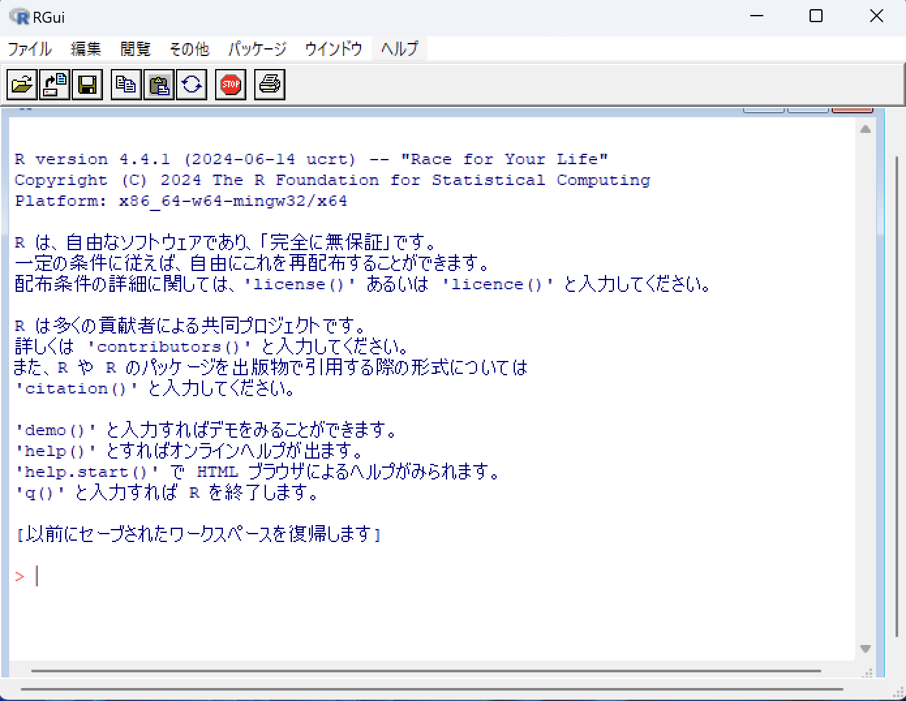
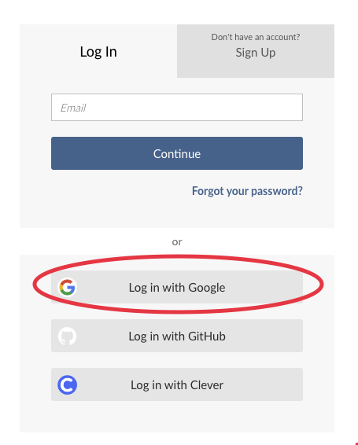
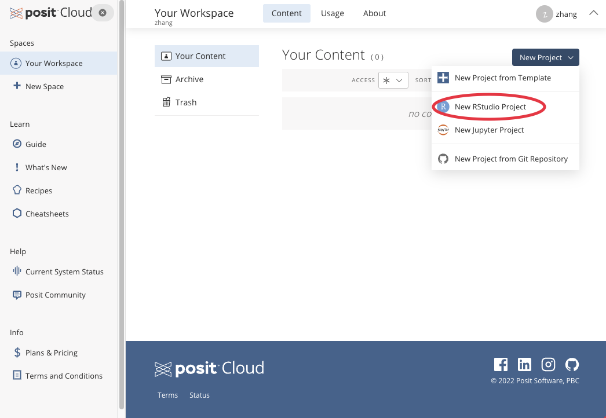
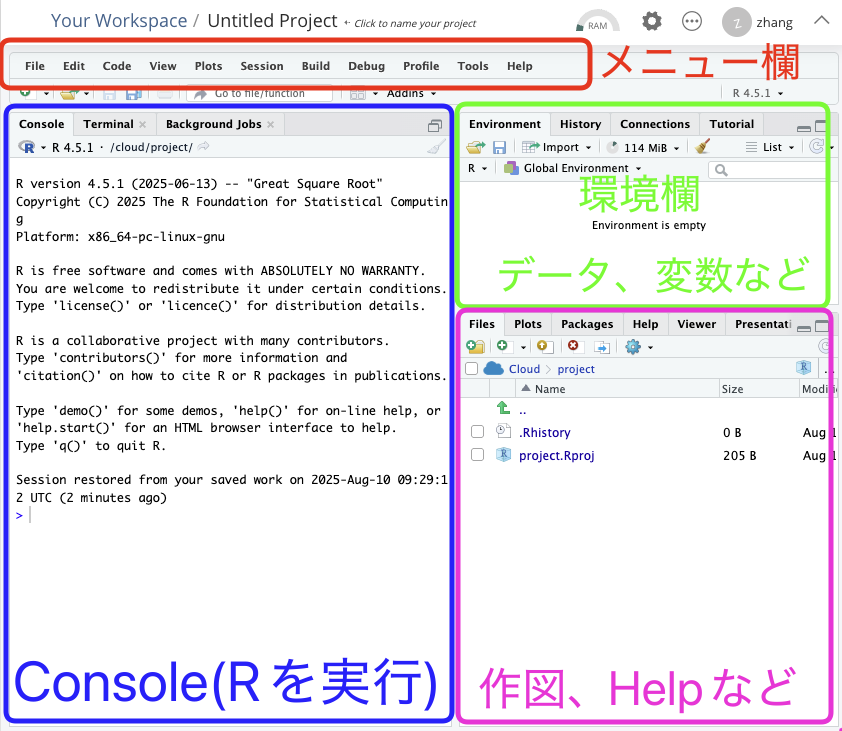
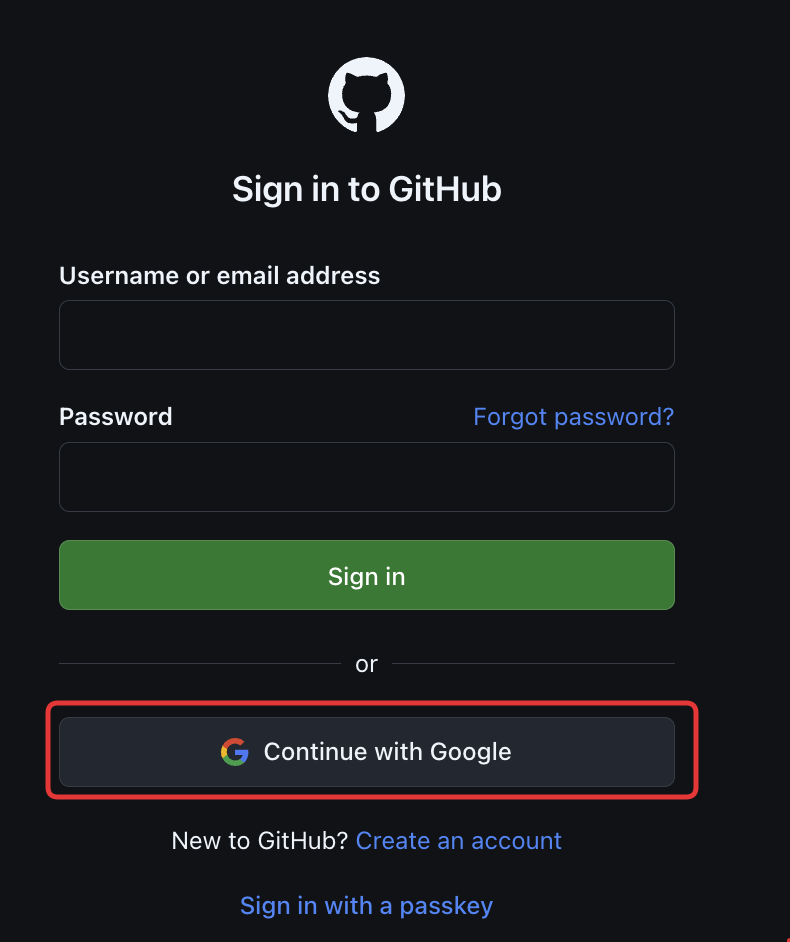
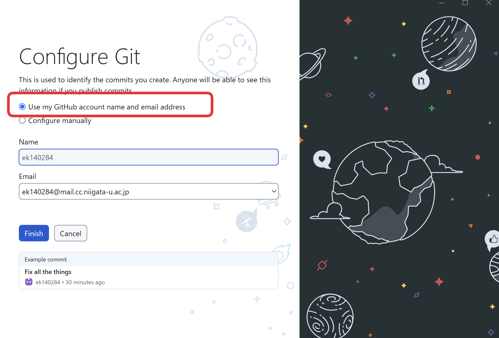

```{r include = FALSE}
knitr::opts_chunk$set(fig.align = 'center', message = F, warning = F)
```

***
**<span style="color:blue">今回の内容</span>**

- この授業の説明（別途のファイルを参照すること）  
https://docs.google.com/presentation/d/18hGcIU0txsYTjcuTYbip8m8W9YWuOX07SDaZzBEKLGo/edit?usp=sharing

- Cloud上でRStudioを体験する（環境設定不要）

- Local環境でRやR Studioをインストールする（各自のパソコンに）

- 課題提出システムに使うGitHubについて

***


# Rとは
{height=20mm}　

R とは、**統計やデータ解析**に特化したプログラミング言語であり、R 言語とも呼ばれている。しかし、R は「見たままが得られる(What You See Is What You Get)」型のソフトウェアではないため、プログラミングの基礎がない者にとっては困難がある。Excel のように容易にデータを確認できるわけではないからである。R の画面は簡素であり、DOS 環境に近いものである。

  
しかし、R には非常に多くの利点がある。第一に、R は**無料**であり、誰でも自由に使用できるのに対し、Stata や Matlab などは非常に高価である。第二に、R には多数の**パッケージ(package)**が存在し、一部は標準で内蔵されており、一部は統計コミュニティのメンバーによって作成されている。これらの既存packageを利用することで、プログラミングに要する時間と労力を削減し、データの可視化、回帰分析、さらには機械学習や深層学習のモデル推定をより迅速に行うことができるのである。

この授業は統計分析の初心者向けであるので、Rの**統合開発環境**(Integrated Development Environment, IDE)である**R Studio**を使用する。R はマウスによる操作ができないのに対し、R Studio はマウスでクリックしたり、Excel のようにデータを表示して確認することができるのである。ただし、この授業ではマウスの使用を極力避け、プログラミング機能によって R を動かすのである。

# CloudでRStudioを体験
R や RStudio を個人のパソコンにインストールするには時間がかかるため、
まずは、Posit Cloud 上に構築された RStudio サービスから R の利用を体験するのである。インストールや環境設定は不要であるが、機能はかなり制限されているのである。

1. https://posit.cloud にアクセしし、**Gmailアカウント**でログインする。

{width=50%}　

2.New Project > New RStudio Project を選択

　

3.少し時間を置いてから、RStudio の画面を確認するのである。

　
(1)メニュー欄にはさまざまな機能が集約されており、たとえば File > Import Dataset を選択することで、マウス操作によってデータを導入することが可能である(ほぼ使わないが)。

(2)Console はメイン画面であり、ここでコードを入力すると計算結果が返ってくるのである。

(3)環境欄にRStudioにあるデータ、変数など**object(オブジェクト)**を確認できる。

(4)右下に作図、Helpマニュアルなどを確認できる。


## 練習1 
初めてのRコードを書いてみよう。定番のHello World。「Show」をクリックして、正解をみることができる。**Console**に入力てみよう。

```{r}
print("Hello World")
```

## 練習2 
次に、変数xに5を代入し、xの値をプリントしよう。環境欄の変化に気づいたのかな？

```{r}
x <- 5
print(x)
```

## 練習3
次に、10の自然対数を計算し、変数yに代入し、プリントしよう。
```{r}
y <- log(10)
print(y)
```


## 練習4
最後に、標準正規分布に従う乱数1000個を発生し、ヒストグラム図を作成する上で、標準正規分布の曲線を描いてみよう。

```{r}
set.seed(123)
z <- rnorm(1000)
hist(z, breaks = 30, freq = FALSE, col = "gray90", border = "white")
curve(dnorm(x), add = TRUE, lwd = 2)
```

ここまでで、大体 R のイメージがついたと思われる。R ではさまざまなプログラムを書き、統計の推定を行ったり、結果を表示したりすることができるのである。


# RやR Studioのインストール
Cloud 上の RStudio はあくまでも体験用であり、性能はかなり低いのである。基本的には、各自のパソコンに R や RStudio をインストールしなければならない。

{height=20mm}

R Studio を実行するには、R 環境が必要である。**必ず下記 1 > 2 > 3 > 4 > 5の順に従いなさい。**


1. [CRAN](https://cran.r-project.org/)で**Rインストールファイルをダウンロード**する。

    - Windows: https://cran.r-project.org/bin/windows/base/

    - Mac: https://cran.r-project.org/bin/macosx/
    
    - Linus: あなたなら楽勝でしょ
    
2. Rをインストールする

3. [R Studio](https://posit.co/download/rstudio-desktop/)で**R Studioインストールファイルをダウンロード**する。

4. R Studioをインストールする

5. 文字コードの設定(文字化け問題)  
    R Studioを起動、上方のメニュー  
    Tools > Global Options > Code > Saving > Default text encoding > **UTF-8**を選択
    
　　

    
## うまくいかない場合

Windows の場合、ユーザー名を日本語(e.g. **<span style="color:red">田中</span>**)で設定していることが多く、そのため R でエラーが多発する。**ユーザー名を半角英数字**にしてください。その他のエラーも各個人のパソコン環境によるため、基本的には各自で解決してください。

- Google検索

- 履修者同士の助け合い

- Chat GPT

教員にメールする前に、必ず自力で試みること。どうしても解決できない場合は、教員にメールで連絡すること。ただし、この授業には TA がいないため、インストールのメール対応は 1 回のみとする。


ほぼ 0 からプログラミングを教える授業ではあるが、最低限のパソコン知識がない場合は、単位の取得は不可能である。インストールができなかった者は、履修のキャンセルを検討すること。次に何をすべきかについては、答えることはできないのである。プログラミングは**試行錯誤から学び、主体性や自立心が必要**である。


# GitHubのインストール

プログラミングの上達には試行錯誤が必要である。これまで、採点やフィードバックには大きな限界があったため、できない者はできないまま、一生プログラミングが上達しないのである。本授業では **GitHub** を導入し、自動採点を行うことで、学生は課題を提出する前に何度も練習し、仮採点を繰り返すことができるのである。


{height=30mm}

GitHub とは、分散型バージョン管理システムである Git を基盤としたソースコード管理プラットフォームである。ソフトウェア開発においてコードの共有、変更履歴の管理、共同作業を容易にする機能を提供している。GitHub はプログラミング初心者にとって難易度が高いため、この授業では**必要な機能に限定**して使用するのである。

![出所: UnrealEngine5の教科書 [ゲーム開発入門続編,第二巻]](./001-guidance/github2.png)

<br>

学生は教員が作成したテンプレートをGitHubのサーバーからダウンロードし、各自のパソコンでプロジェクトを管理して課題に取り組む。その後、完成したプロジェクトをGitHubにアップロードし、教員が採点する。学生は教員が作成した元ファイルを編集できず、学生が作成したファイルも学生本人および教員のみが閲覧できるのである。いわゆる**Project Based Learning**である。学生はProject(課題)をクリアすることで、プログラミングの経験値を積み重ねるのである。

**GitHub**のインストールは、**下記 1 > 2 > 3の順に従いなさい。**

1. GitHubアカウントを新規作成  
  https://github.com/login  
 「Continue with Goggle」をクリックし、**<span style="color:red">大学のGmailアカウント</span>**でログインしなさい。成績評価の関係上、個人のGmailは使ってはいけない。
 
    {width=50%}　


2. GitHub Desktopをダウンロードする  
https://desktop.github.com/download/

3. GitHub Desktopをインストール

4. GitHub Desktopを起動し、ログインする  
「Use my GitHub account name and email address」のままで進む  
（手動でnameを変更する場合、学籍番号が追跡できなくなる）

    　


**GitHubを用いた課題提出の流れについては、後日チュートリアルを実施**する予定である。現時点では、インストールするだけで良い。すでにバージョン管理システムの使用経験があり（例：git clone、git add、git commit、git push を理解している場合）、自身の慣れた方法を使用してよい。必ずしも GitHub Desktop をインストールする必要はない。

