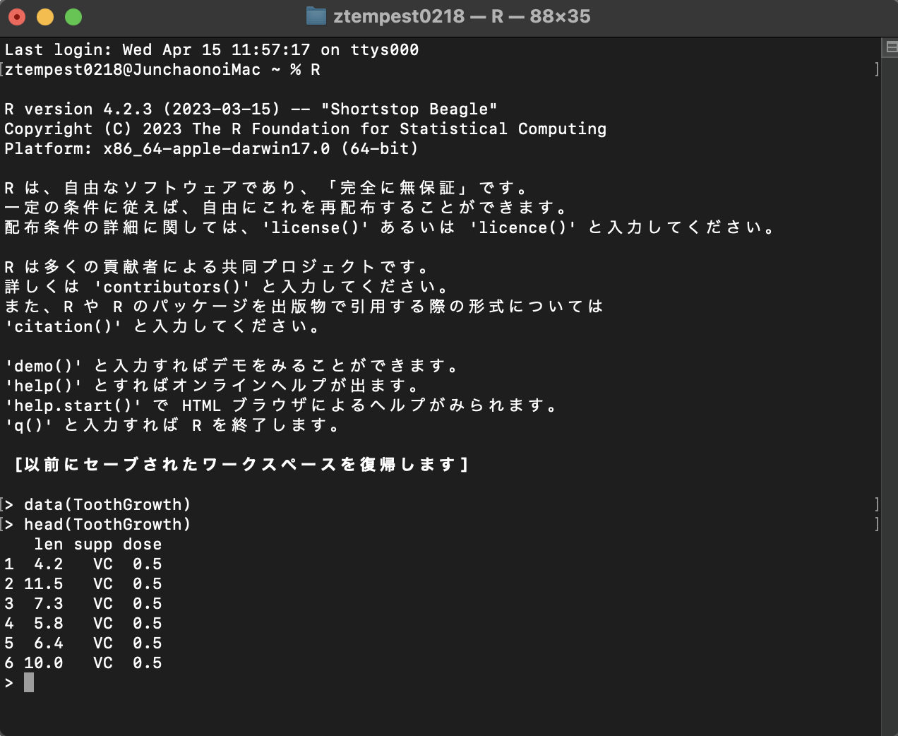
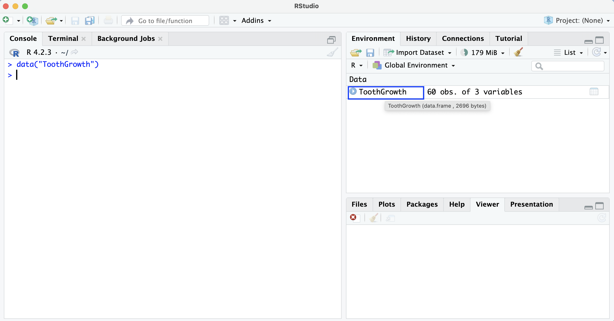
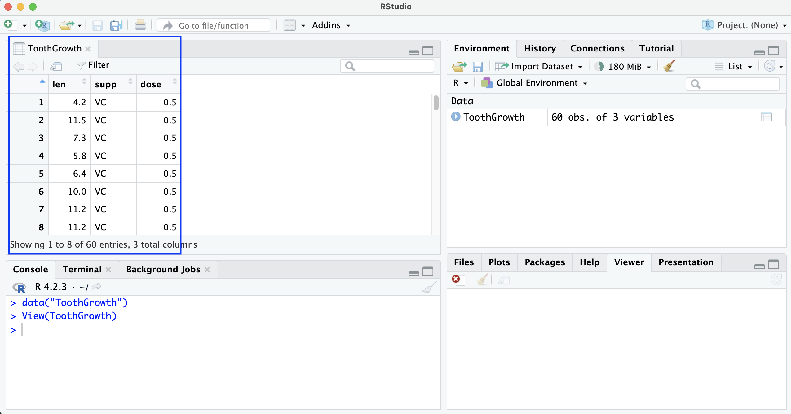
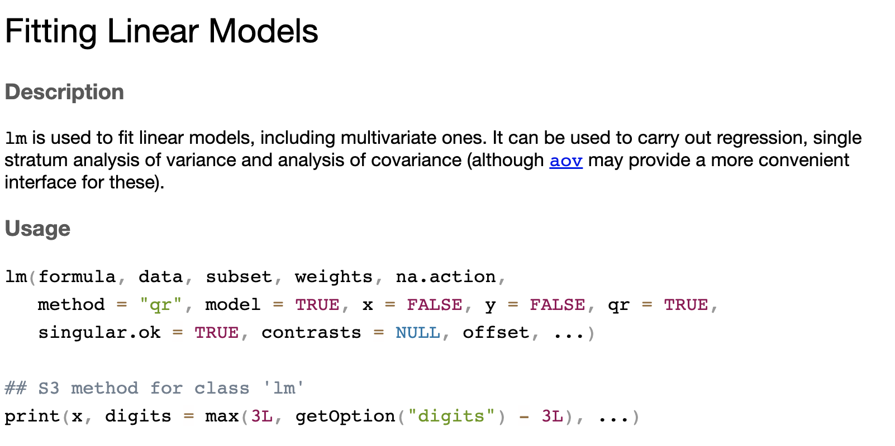
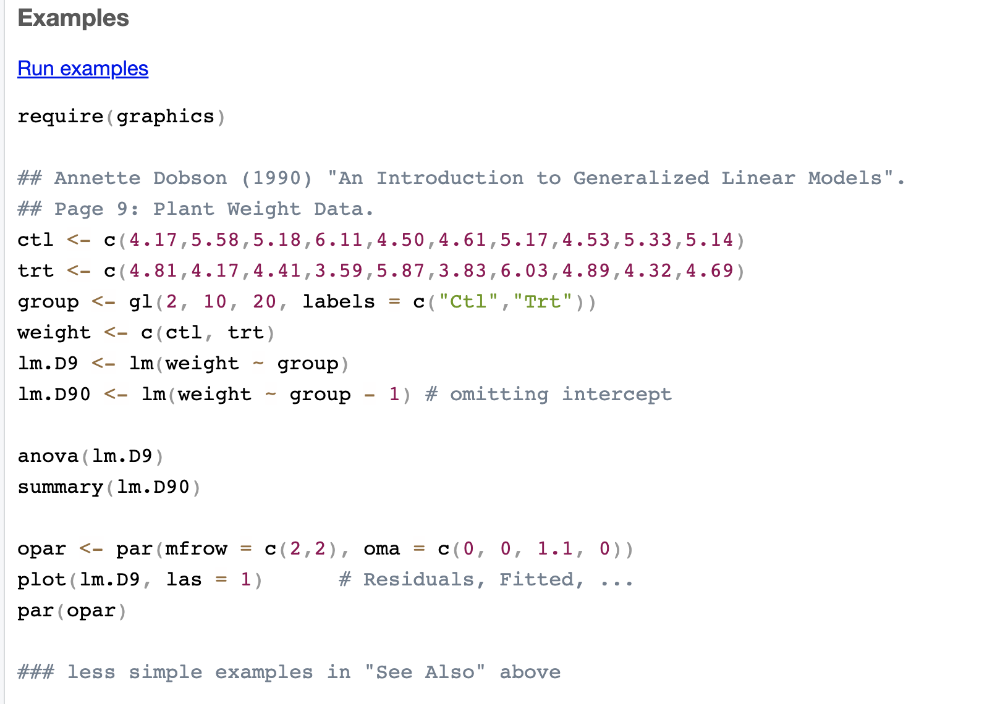
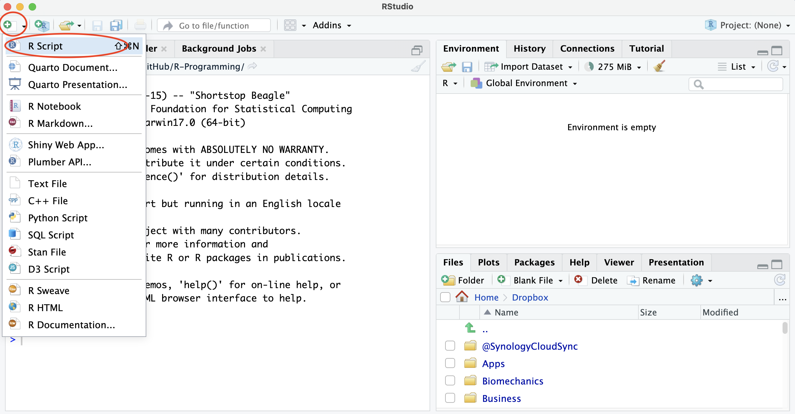
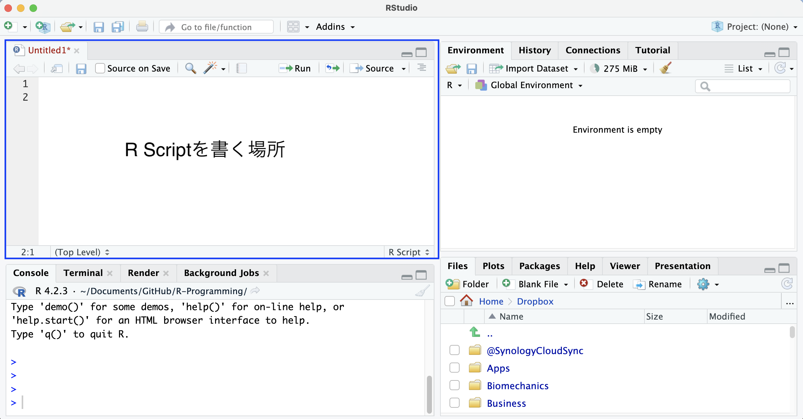
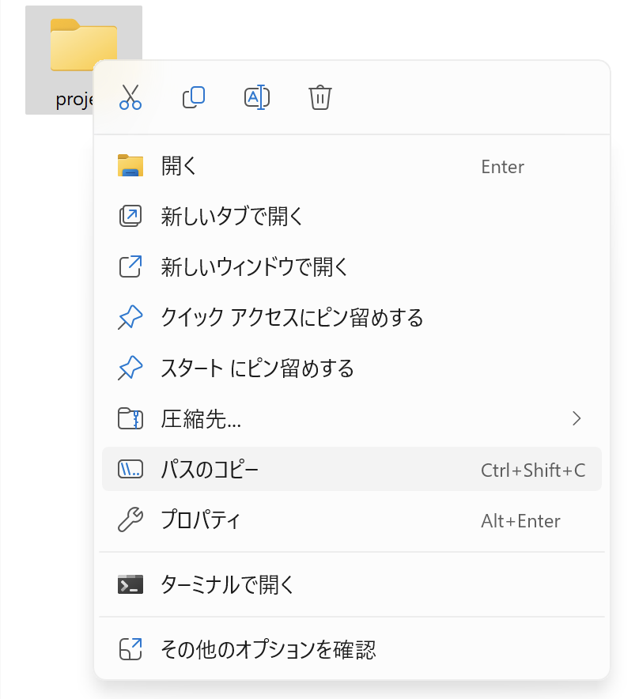
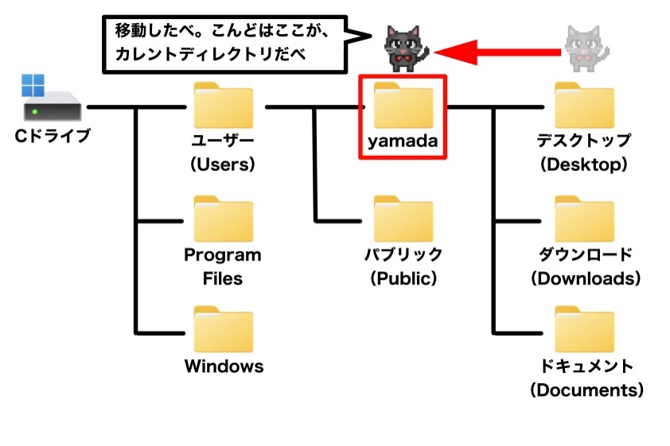

```{r include = FALSE}
knitr::opts_chunk$set(fig.align = 'center', message = F, warning = F)
```

***
**<span style="color:blue">今回の内容</span>**

- 履修者は大学のアカウントでGoogle classroomを登録してください。<br>
  https://classroom.google.com/c/ODU4NzQ3NjMxOTc2?cjc=utkd2j67

- R Studio環境

- R Script(for Programming)

***


# R Studio環境
R Studio開発環境はプログラミング初心者にとっても、比較的に習得しやすい。Rのプログラミング機能を持つまま、マウスでクリックする機能が加えられたものである。極力マウスを使わないが、補助として使ったりすることがある。

```r
data(ToothGrowth)
```

上記コードをConsoleに打って、ToothGrowthというデータを投入する。中は`len`歯の長さ、`dose`ビタミンCの量、`supp`与え方(ジュース or 錠剤)の変数がある。通常、Rの中はexcelみたいが画面がなく、`head()`関数を使って、データの一部を確認することになる。

{width=70%}

excelのように直感的に見ることができないのである。データの所在も確認しづらい。

R Studioでデータを投入する場合、**環境欄(Environment)**で確認することができ、excelのように一個一個のセルに入っているように表示することができる。

{width=100%}
データを投入した後、環境欄に`ToothGrowth`というオブジェクト(object)が入っている。60 obs. of 3 variablesなど(観測値observations 60個、変数３つ)簡単な情報を確認することができる。マウスでクリックすると、

{width=100%}
excelっぽい画面が表示され、実際データをexcelと同様に確認できる。この機能は意外と重要、プログラミングのミスでデータの中身を変えてしまったり、構造が変になったり、目視することが必要である。

下記コード`View()`でマウスを使わなくてもデータを閲覧できる。
```r
View(ToothGrowth)
```

`summary()`関数で簡単な記述統計を出すことができる。

```{r}
summary(ToothGrowth)
```

`lm()`関数で簡単な回帰分析をすることができる。

```{r}
lm(len ~ dose, data = ToothGrowth)
```

ビタミンC 1mgを追加して投入すると、歯の長さが9.764mm伸びるという結果になる（統計的有意性はとりあえず無視）。

`plot()`関数で簡単な可視化もできる。
```{r}
plot(ToothGrowth$dose, ToothGrowth$len)
```

R Studioを使用するには、**先験的知識**が必要なのである。つまり、記述統計を出すにはどの関数を使うか、回帰分析をするにはどの関数を使うか、可視化にはどの関数を使うか、あらかじめ理解しておく必要がある。必要な関数を理解していなければ、プログラミングができないのである。

## Rのこれまでの学習方法

プログラミングのスキルは試行錯誤しながら、身につけるものである。0からいきなり10000行のコードができる人は一人もいない。従来の学習方法として、

1. Google
2. [Posit Community](https://forum.posit.co/)
3. Help機能

現在はChatGPTやClaudeなどAIがかなり進展していて、**考えずにコピペー**する人や**基礎知識がなくdebugできない人**がかなり増えている。私的には、GPTに「Rの課題をやってください」のような使い方はお勧めしない。「回帰分析する際に、Rは何関数を使うの？文法を教えてください。」のような聞き方、そしてコピペーするよりも、自力で入力して試行錯誤の方が良いように思う。意思決定は人間が行うべきである。

データ処理に関する業務上の問題、分析者本人が理解しなければならない。Project Based Learning(PBL)で自ら「研究テーマ」を設定し、プロジェクトの実現に向けて主体的に行動することが効率的。たとえば、「映画館の売上分析と予測」のプロジェクトを立ち上げ、

- チケット収入、ポップコン・飲み物収入やグッズ収入の構成
- どうな人はよく映画館にいくか？
- 収益の季節トレンドやボラティリティ
- クーポン出して売上の向上につながるか？

問題意識を持ちながら学習することで、Rの習得はより速くなる。徐々に自分のcode(コード)を蓄積することで、さまざまな問題にすぐ応用できる実践力が生まれる。e.g. [イランからUAEへの攻撃数](https://ztempest0218.github.io/img/iran_attacks.png) 

### Help機能
基本的にAIはGoogle、Posit CommunityやRに内蔵するマニュアル(help機能)のテキストデータを学習した結果、Rのコーディングができている。よって、自作プログラムだったり、最新のアルゴリズムだったり、AI対応できないこともある。インフラ関係のエンジニアの場合、施工図や施工マニュアルを確認しなければならない。Help機能はRユーザー向けのマニュアルであり、すべてのcoding文法は調べられる。

Helpを使うには、`help`または`?`を使用する。たとえば、`lm`関数の使い方を調べたいとき、

```r
help(lm)
```

または

```r
?lm
```

を実行すれば、右下の画面にマニュアルが表示される。

{width=100%}

{width=100%}

# R Script
プログラミングをする際に、**R Script**を書くのが基本である。**Console**はコードを動作確認したり、debugしたり、あくまでも実験の場と理解すれば良い（コードを打ってすぐ結果が返してくれるため、「機能」の確認に有効）。

R Scriptとは、**再現可能**な処理を記録するファイルのこと。工程順にRコードが記述されているため、誰が実行しても同じ結果が得られるのである。他の言語の経験があれば、Pythonの.py、MATLABの.m、SASの.sas、Stataの.do拡張子と同様のものとして理解できる。

基礎的な統計分析をする際に、
  
1. データを読み込み
2. データクリーニング
3. 変数構築や欠損処理
4. 記述統計や可視化
5. 分析・推定を行う

が典型的な流れである。R Scriptファイルは、1→2→3→4→5の一連の処理を順序立てて記録したものである。実際の研究において、前処理が9割である。

R Scriptを新規作成するには、上方の<span style="color: green;">**＋**</span>アイコンをクリックし、**R Script**を選択すると
{width=100%}　


{width=100%}　

上図のように左上にR Scriptのファイルができている、プログラミングするとき、ここでコードを書くのである。一般的には、**R Scriptには**確認された、**正しく実行できるコードを保存**する。一方、Consoleは自動的に左下に配置され、コードの実行結果が表示される場所でもあり、一時的にdebugして部分コードをテストする場所でもある。この授業では、マウスを極力使わないため、R Scriptで作業するのが基本である。

```r
print("Hello World")
```

上記をR Scriptに記述し、実行してみましょう。前回はConsoleで実行してもらったが、保存されないため、都度に手入力する必要がある。R Scriptを使用する場合、何度でも実行することができ、同じ結果が得られる。入力ミスで"Halo World"とか、"Hello Wood"になることはない。一方、excelのようなソフトは人為的ミスが多く、再現性がかなり悪い。

## フォルダ管理
R言語を学習する際に、**フォルダ管理**の概念があれば、データ、プログラミングScriptや成果物の管理がかなりしやすくなる。下記の図では、すべての内容がprojectというフォルダの下に保存され、さらにサブフォルダがいくつか存在し、データはproject/dataに保存され、プログラミングファイルはproject/scriptに保存され、成果物はproject/outputに保存されている。

```text
project/
├── data/
│   ├── raw/
│   └── clean/
├── script/
│   └── analysis.R
├── output/
│   ├── tables/
│   └── figures/
└── README.md
```

きれいなフォルダ構造は**チームワーク**に必須。後から直すのがかなり大変で、最初から良い習慣をつけたらと考える。「何ファイルはどこに保存するか」を最初に決めましょう。

### 絶対パス(Absolute path)
絶対パスはファイルの場所を厳密に指定する方法。projectはデスクトップに保存されるとする。analysis.Rをアクセスするには、

Macの場合<br>
"/Users/ユーザー名/Desktop/project/script/analysis.R"


Windowsの場合<br>
"C:/Users/ユーザー名/Desktop/project/script/analysis.R"

を指定しなければならない。プログラミングファイルに複数の絶対パスがある場合、環境が変更し次第、実行ができなくなるのである。AさんとBさんのパソコンの**ユーザー名**が違うから。補足: 各自のパソコンにユーザー名を**<span style="color:red">半角英数字</span>**に設定してください。日本語のユーザー名はよくエラーを起こすのである。

この授業では、絶対パスを禁止とする。

### 相対パス(Relative path)

相対パスは「現在地」から指定する方法。デスクトップに保存されるprojectフォルダは、作業領域(**Working directory**)とする。すべてのファイルはprojectにある。

Workingディレクトリを確認するためには、**getwd()**を実行すれば「現在地」が返してくれる。("working directoryをgetする"が覚えやすいかもしれない)

```{r}
getwd()
```

上記のように、workingダイレクトりが**\\project**に設定されてないため、project下のファイルにはアクセスできない。wdを設定するには、**setwd()**を使う。

1. デスクトップに**projectというフォルダ**を手動で作っておきましょう。(右クリック-新規作成-フォルダ)

2. projectをwdに指定する。(R Scriptに書く)


Windowsの場合、下記のように、一度**絶対パス**で指定する必要がある。
```r
setwd("C:/Users/ユーザー名/Desktop/project")
```

{width=50%}　

フォルダに右クリックし、「パスのコピー」ができる。ただし、Windowsはデフォルトに「`/`」(スラッシュ)ではなく、「`\`」(バックスラッシュ)を使用しているため、コピーしたパスをRで使用する場合エラーが出る。


"C:\\Users\\ユーザー名\\Desktop\\project" を

**<span style="color:blue">"C:/Users/ユーザー名/Desktop/project"</span>** に

修正すること。プログラミングしない人は滅多に使わない記号だから、入力方法がわからない場合[キーボードテスト](https://sfosdemo.bitbucket.io/kbjp/index.html)を参照する。

Macの場合は比較的に簡単で、`~`でユーザー名までのパスを指定できる。

```r
setwd("~/Desktop/project")
```

一度、wdを指定したら、毎回"C:/Users/ユーザー名/..."のように初めから書く必要がなくなる。wdを「現在地」とし、wdの下(または上)の層にフォルダなどを作成することができる。

```r
dir.create("./data/raw", recursive = TRUE)
```
上記コードは、workingディレクトリの下、dataサブフォルダを作成し、その下にrawというフォルダーを作成する。通常、直接に２つ下にフォルダ作成することができない、中間層にあるフォルダは存在しないから。`recursive = TRUE`を指定することで、中間層のフォルダも自動的に作成してくれる(上記の例では、中間層が`data`である)。

相対パスの記号について、

| 記号          | 意味           |
|:--            |:--             |
| `.`           | 今いる場所     |
| `..`          | 1つ上          |
| `../..`       | 2つ上          |
| `フォルダ名/` | 下のフォルダへ |

[`..`]と[`../..`]は小さな研究プロジェクトに使用されることが少ないが、巨大プロジェクトの場合wd上の層のファイルをアクセスすることが時々ある。卒論や授業など小さなプロジェクトをメインとする場合、[`.`]と[`/`]を理解すれば良い。

{width=100%}　
Source: オリジナルゲーム.com

### フォルダ構造のツリー表示
通常、Windowsでフォルダ構造を確認する場合、ダブルクリックで入ったり、後退したり、何回か繰り返さないといけない。かなり不便である。

Rでは、`fs`というpackageを利用することで、ツリー構造を簡単に確認できる。ただし、`fs`はRの標準機能ではないため、初回はインストールする必要がある。

```r
install.packages("fs")
```
`install.packages()`は一般的に、Consoleで実行する。インストールした後、再度する必要はないから。R Scriptに残すと、余計にエラーが出ることになる。

```r
library(fs)
dir_tree()
```

`fs`は外部packageのため、都度にpackageを読み込ん(`library(fs)`)でから使用する。直接に`dir_tree()`を打つ場合、結果が出ない。`library()`を覚えておいてください。

# 課題
```text
project/
├── data/
│   ├── raw/
│   └── clean/
├── script/
│   └── 001-folder.R
├── output/
│   ├── tables/
│   └── figures/
```

1.上記の構造のように、フォルダを作成しなさい。

2.R Scriptを、/project/scriptに「001-folder.R」として保存する。

3.上記のツリー構造を出力しなさい。

(補足: フォルダを作成したらずっと存在するので、繰り返してR Scriptを実行するときエラーが出る。現時点は、無視してください。以降はloopや条件分岐でコードを改良することができる。)

今回の課題はかなりシンプルで、フォルダ構造の理解や作成がメインであるため、提出は必要ない。授業時間中に取り組み、何かわからないことがあれば、Zoom画面共有する上で指導を行うことになる。授業終了後、下記formに記入してください。

https://docs.google.com/forms/d/e/1FAIpQLSfwT45DGMhg9rZo4ABmSg7Zz7nwT1CDrkEWDMIcIjwkgjN7kw/viewform?usp=publish-editor

