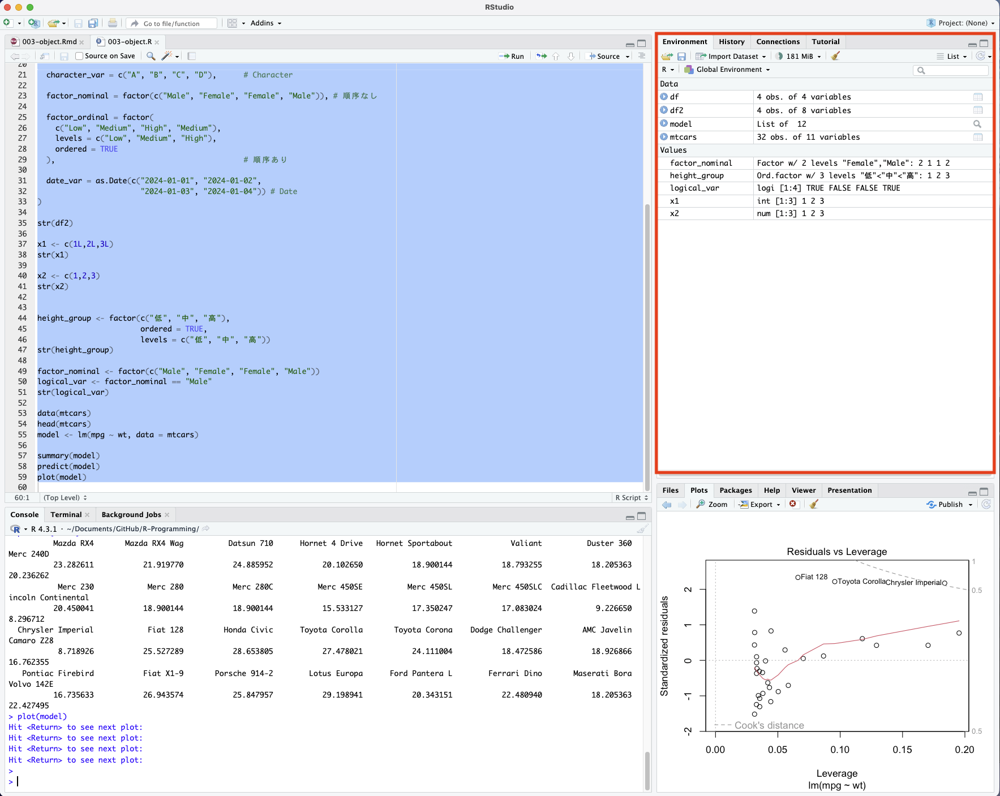

```{r include = FALSE}
knitr::opts_chunk$set(fig.align = 'center', message = F, warning = F)
```

***
**<span style="color:blue">今回の内容</span>**

- データ型

- オブジェクト

***


# データ型
データ型(data type)において、呼び方は分野によって異なることが多い。統計学では変数の意味や測定尺度に基づいて分類されているのに対し、データサイエンスは計算機上の表現や処理方法に基づいて分類が行われる。両者の間には一定のずれが存在するが、実務上は適切に解釈すれば、RやR Studioの使用には特段の支障を生じない。


## 統計学において
統計学の分類として、

- 質的変数 Qualitative vairiable<br>
(カテゴリ変数 Categorical variableとも呼ぶ)

  - 名義尺度: 性別、産業
  
  - 順序尺度:満足度、重症度分類、成績評価

- 量的変数 Quantitative variable<br>

  - 離散変数: 労働者数、サイコロの出る目
  
  - 連続変数: 血圧、体重、身長
  

下記コードをR Scriptにコピーし、実行してください。4つの変数と4人の観測値を持つデータが生成される。
```{r}
df <- data.frame(
  gender = factor(c("Male", "Female", "Female", "Male")),   # 名義尺度
  satisfaction = factor(c("Low", "Medium", "High", "Medium"), 
                        ordered = TRUE, 
                        levels = c("Low", "Medium", "High")), # 順序尺度
  workers = c(10L, 15L, 8L, 20L),   # 離散変数
  height = c(170.5, 160.2, 158.3, 180.1) # 連続変数
)

str(df)
```
  
性別`gender`は名義尺度(順序なし因子型)、満足度`satiffaction`は三つの水準(Low, Medium, High)を持つ順序尺度(順序あり因子型)、`workers`労働者数は離散変数(整数型)、`height`身長は連続変数(実数型)である。


## データサイエンスにおいて
  
データサイエンスの分類として、

- 論理型 Logical

- 数値型 Numeric
  
  - 整数型 Integer
  
  - 実数型 Double(整数を含む)
  
- 複素数型 Complex

- 文字型 Character

- 因子型 Factor
 
  - 順序なし
  
  - 順序あり

- 日付型 Date など

```{r}
df2 <- data.frame(
  logical_var = c(TRUE, FALSE, TRUE, FALSE),  # Logical
  
  integer_var = c(1L, 2L, 3L, 4L),            # Integer
  
  double_var = c(1.5, 2.3, 3.7, 4.1),         # Double
  
  complex_var = c(1+2i, 2+3i, 3+4i, 4+5i),    # Complex
  
  character_var = c("A", "B", "C", "D"),      # Character
  
  factor_nominal = factor(c("Male", "Female", "Female", "Male")), # 順序なし
  
  factor_ordinal = factor(
    c("Low", "Medium", "High", "Medium"),
    levels = c("Low", "Medium", "High"),
    ordered = TRUE
  ),                                          # 順序あり
  
  date_var = as.Date(c("2024-01-01", "2024-01-02", 
                       "2024-01-03", "2024-01-04")) # Date
)

str(df2)
```


注意してほしいのは、データサイエンスにおけるデータ型は、あくまでも計算機上での保存形式および処理方法を規定するものであり、変数の統計学的な意味や性質を直接表すものではない。例えば、**離散型は厳密に整数型に一致しない、連続型も実数型に厳密に一致しない**。

```{r}
x1 <- c(1L,2L,3L)
str(x1)

x2 <- c(1,2,3)
str(x2)
```


上記、`x1`と`x2`どちらでも`1,2,3`の整数に見えるが、`x1`は整数型、`x2`は実数型である。整数が実数の部分集合($\mathbb{Z} \subset \mathbb{R}$)であるから、実数型も整数を保存することができる。`str()`はオブジェクトの構造(structure)を示す関数である。

```{r}
height_group <- factor(c("低", "中", "高"), 
                       ordered = TRUE,
                       levels = c("低", "中", "高"))
str(height_group)
```

身長は原理的に連続型変数(`160.5,160.8,161.2...`)であるが、データ処理をするときに、低身長、中身長や高身長のグループに分けて、計算機において順序ありの因子型で保存することもある。


```{r}
factor_nominal <- factor(c("Male", "Female", "Female", "Male"))
logical_var <- factor_nominal == "Male"
str(logical_var)
```

上記、因子型(`男性、女性`)を論理型(`男性である、男性でない`)に変換することもできる。これが実質的に統計学上の**ダミー変数**（男性であれば1、その他0）に相当する。

\[
D_i =
\begin{cases}
1 & \text{if individual } i \text{ is male} \\
0 & \text{otherwise}
\end{cases}
\]

各データ型の間には相互変換が可能であるが、データ型はあくまで表現形式にすぎない。したがって、分析の目的および変数の意味に応じて、適切なデータ型へ変換・調整することが必要である。

### 因子型を論理型にする例

因子型は文字列が入っているため、数値的意味を持たなく、定量的な分析もできないのである。ダミー変数(1と0)に変換することで、男性/女性である効果を回帰分析できるようになる。

\[
Income_i = \beta_0 + \beta_1 D_i + u_i
\]

ここで、\(D_i\) は男性ダミー変数であり、男性であれば \(D_i=1\)、女性であれば \(D_i=0\) とする。このとき、上式は男性と女性の所得の差を推定する単回帰モデルである。

\[
Income_i =
\begin{cases}
\beta_0 + u_i & (D_i = 0,\ \text{女性}) \\
\beta_0 + \beta_1 + u_i & (D_i = 1,\ \text{男性})
\end{cases}
\]

したがって、

\[
\beta_1 = E[Income_i \mid D_i=1] - E[Income_i \mid D_i=0]
\]

であり、\(\beta_1\) は男性と女性の平均所得の差を表す。因子型のままにする場合、男性ごとに所得を合計して平均をとり、女性ごとに所得を合計して平均をとり、平均の差を計算することとなる。

# オブジェクト

プログラミングには代表的に、**手続型プログラミング(Procedural programming)**と**オブジェクト指向プログラミング(Object-oriented programming)**の二つの考え方がある。

- 手続型プログラミング(Procedural programming)<br>
処理を一連の手順として記述する方法である。**何をどの順番で行うか(手順)**重視する。典型的な手続型言語は、CとFortranがあり、数値計算が強い。

- オブジェクト指向プログラミング(Object-oriented programming)<br>
データとその操作を一体として「オブジェクト(対象)」として扱う方法である。**誰が何をするか(役割)**を重視する。典型的なオブジェクト指向言語は、　JavaとC#がある。

C++、Python、**Rは**いずれも**ハイブリッド型の言語**であり、手続型プログラミングとオブジェクト指向プログラミングの両方に対応している。ただし、オブジェクトの概念があれば、Rプログラミングにおいて圧倒的に便利になる。Everything is an object.

```{r}
data(mtcars)
head(mtcars)
model <- lm(mpg ~ wt, data = mtcars)
```
上記は、Rに内蔵されている`mtcars`のデータ(車種、燃費、エンジンシリンダー数、排気量、馬力、ギア比、重量など変数がある)を導入し、簡単な回帰分析を行うコードである。`model`オブジェクトに、データ、推定結果、残差、分散などさまざまな情報が含まれている。オブジェクトの結果は重複使用ができるので、管理が簡単。

```r
summary(model)
predict(model)
plot(model)
```


例えば、同じオブジェクト`model`に対して、`summary`、`predict`や`plot`など関数を実行することができる。一度計算すると、何度でも重複利用ができる。

```r
# summary
summary(lm(mpg ~ wt, data = mtcars))

# predict
predict(lm(mpg ~ wt, data = mtcars))

# plot
plot(lm(mpg ~ wt, data = mtcars))
```

上記は手続型的な書き方の一例である。この場合、分析の目的ごとに「データ投入 → 推定 → 要約」「データ投入 → 推定 → 予測」「データ投入 → 推定 → 作図」といった処理を繰り返す必要がある。すなわち、手続型プログラミングでは同一の計算過程（推定）を目的ごとに再実行する構造となる。このような記述は分析の流れを直線的に表現できる一方で、計算結果の再利用という観点では非効率である。一部の分野、特に数値計算（例えば構造モデルのシミュレーションや天気予報など）においては、計算効率が最優先されるため、CやFortranのような手続型言語が広く用いられている。

一方、オブジェクト指向プログラミングでは、計算結果を**オブジェクト(対象)**として保存し、それを再利用することが可能である。特にデータ駆動型の手法においては、モデルやデータをオブジェクトとして一体的に扱うことが多く、このような設計は分析の再利用性および拡張性を高めるうえで重要である。

## Rの中のオブジェクト

Everything that exists is an object. Rでは、ほぼすべてのものがオブジェクトとして扱われる。数値や文字列といった基本的なデータから、データフレーム(excelっぽい)、回帰モデル、時系列モデル、さらには関数に至るまで、統一的にオブジェクトとして管理される点が特徴である。名前が付いたオブジェクトがすべてRの環境欄(Environment)に表示される。このような設計は柔軟なプログラミングを可能にする一方で、初学者にとっては構造が把握しにくく、理解の負担となる場合がある。

{width=100%}

これに対して、Stataはデータ中心のソフトウェアであり、一覧には主に変数（variable）のみが表示される。そのため、構造は比較的単純で直感的に理解しやすい。一方で、Rのように多様なオブジェクトを組み合わせて柔軟にプログラミングを行うことには制約がある。

{width=100%}

## Rでよく使うオブジェクト

システム内部において、オブジェクトの「生成」と「保存」は別の概念である。Rでは、関数の実行過程で一時的なオブジェクトが生成され、メモリ上に存在するが、変数に代入しない限り保持されない。そのため、必要に応じて一時的に呼び出されて処理に利用されるものの、処理が終了すると消失する。

一方、オブジェクトとして保存された場合には、環境欄に表示されるため、ユーザーはその存在を直接確認することができる。誤解を避けるため、本授業において取り扱うオブジェクトは、原則として保存され、環境欄で確認可能なものに限定する。

オブジェクトを保存するには、`<-` を用いる。Rにおいて、`<-` は代入を意味する。

```{r}
x <- 5
```

`x <- 5` のように、記号の前後に半角スペースを入れることが望ましい。`x<-5` のようにスペースを入れなくても実行は可能であるが、コードの可読性を高めるためには、記号の前後に1つの半角スペースを入れる習慣を身につけること。コードにおいては、**全角スペースの使用は禁止**である。debugかなり大変になるから。入門授業において、見た目が同じコードであってもエラーが生じる場合、その原因の多くは全角スペースの混入によるものである。

基本演算

```{r}
1 + 2   # 足し算
5 - 3   # 引き算
4 * 2   # 掛け算
8 / 2   # 割り算
```
Rの基本演算は、通常の数学と同様の直感で扱うこととなる。

べき乗、例えば$2^3$や$e^5$を計算する場合

```{r}
2^3     # 8
exp(5)  # 148.41
```

実際のデータ分析においては、基本的な演算や冪乗を直接用いる機会はそれほど多くないが、基礎理解のために一度は手入力して確認しておくことが重要である。

### ベクトル
ベクトルとは、同一のデータ型からなる1次元のデータ構造である。

```{r}
a <- c(1, 2, 3, 4)
str(a)
```

ベクトルを作成する際に、`c(..., ..., ...,)`を使う。上記のように`1,2,3,4`を入力すると、実数型(Double)になっている。

```{r}
b <- c(1L, 2L, 3L, 4L)
str(b)
```

実務上、整数型（integer）を明示的に使用する場面はそれほど多くないが、数値の末尾に大文字の L を付加することで、整数型のデータとして扱うことができる。

```{r}
c <- c("A", "B", "C", "D")
str(c)
```

文字列`A, B, C, D`を入力し、ベクトルを作成することもできる。文字として扱うとき、`""`ダブルクォートで囲むこと、`""`内にスペースの入力が不要。``A　　　``のように余計にスペースを入れてしまった場合、スペースも文字として扱われる。

```{r}
pref <- c(
  # 北海道地方
  "北海道",
  
  # 東北地方
  "青森県", "岩手県", "宮城県", "秋田県", "山形県", "福島県",
  
  # 関東地方
  "茨城県", "栃木県", "群馬県", "埼玉県", "千葉県", "東京都", "神奈川県",
  
  # 中部地方
  "新潟県", "富山県", "石川県", "福井県",
  "山梨県", "長野県",
  "岐阜県", "静岡県", "愛知県",
  
  # 近畿地方
  "三重県", "滋賀県", "京都府", "大阪府", "兵庫県", "奈良県", "和歌山県",
  
  # 中国地方
  "鳥取県", "島根県", "岡山県", "広島県", "山口県",
  
  # 四国地方
  "徳島県", "香川県", "愛媛県", "高知県",
  
  # 九州・沖縄地方
  "福岡県", "佐賀県", "長崎県", "熊本県", "大分県", "宮崎県", "鹿児島県",
  "沖縄県"
)
str(pref)
```

文字列は数値的な意味を持たないが、繰り返し処理(loop)を行う際に非常に便利である。e.g. 同様な統計分析を47県ごとに推定する。補足:`#`はコメント(メモ)を記述するための符号。プログラムを実行するときに、除外される。

異なるデータ型のものでベクトルを作成すると、どうなるでしょう。

```{r}
d <- c(1, "A", TRUE)
str(d)
```

ベクトル d には、数値型の 1、文字列の "A"、論理型の TRUE といった異なるデータ型の要素が含まれている。しかし、実際に作成されたオブジェクトでは、これらの要素はすべて "1"、"A"、"TRUE" のように自動的に文字列へ変換される。その結果、ベクトル d は文字型（character）として扱われる。
（このようなケースは通常ほとんど発生せず、データ処理上のミスである可能性が高い。）

```{r}
a <- c(1, 2, 3, 4)
a[1]
a[2:3]
a[a > 2]
```

ベクトルaの個々の要素もオブジェクトとして、呼び出すことができる。`object[i]`であれば、object中i番目の要素を確認できる。`object[i:j]`であれば、i番目からj番目までの要素を確認できる。`object[object > n]`であれば、nより大きい要素を確認できる。たくさん抽出の方法があるので、ここでは一部だけを紹介する。

```{r}
a[1] <- 10
a
```

`object[i] <- ?`のように、オブジェクト中の要素を書き換えることもできる。ここでは、オブジェクトaの1番目の要素を10に書き換えた。

```{r}
a + 2
a - 2
a * 2
a / 2
```
オブジェクトも基本演算することができる。

### 行列
行列（線形代数）を扱うことができるソフトウェアでは、行列を用いた計算が可能である。これにより、ベクトルや行列を用いた一括計算（ベクトル化計算）が可能となり、繰り返し処理を減らすことができる。また、数式に近い形でプログラムを記述できるため、理解しやすいという利点がある。
MATLABは典型的な行列言語であり、R、GAUSS、Juliaなども行列演算を用いたプログラミングを行うことができる。Python+Nunmpyを使うと、行列計算もできる。

```{r}
x <- 1:6
A <- matrix(x, nrow = 2)
A
```

上記は`1,2,3,4,5,6`のベクトルを作成し、それを2行を持つ行列として充填したものである。

```{r}
dim(A)      # Dimension
nrow(A)     # Row
ncol(A)     # Column
```

行列の構造を確認するには、`dim()`を使う。その他、行数と列数を確認できる関数もある。数学やデータサイエンスにおいて、**行は横方向、列は縦方向**である。Aは2行3列の行列である。

```{r}
A[1,2]
A[1,2] <- 8
```

ベクトルと同様に、角かっこで要素の呼び出すことができる。ここでは、行列Aの1行2列目のデータ`A[1, 2]`が返してくれた。行列の中の要素も、変えることができる。

以下、少し展開して、行列を用いた計算を紹介する。下記の単回帰モデルを考えて、$\beta_{1}$が関心のあるパラメーター、xがyに与える限界効果として理解できる(推定バイアスを無視)。

$$y_{i}=\beta_{0}+\beta_{1}x_{i}+u_i$$
通常は、$\sum (x-x_i)(y-y_i)$と$\sum (x-x_i)^2$を計算し、

\[
\hat{\beta}_1
=
\frac{
\sum_{i=1}^{n} (x_i - \bar{x})(y_i - \bar{y})
}{
\sum_{i=1}^{n} (x_i - \bar{x})^2
}
\]

これを線形単回帰の解析解であり、代数的方法使っている。

一方で、行列を使う計算方法がかなりわかりやすくて、直感的である。行列を使う計量経済学のテキストを調べると、最小二乗推定量は


\[
\hat{\beta} = (X^{\top}X)^{-1}X^{\top}y
\]

行列積、転置や逆行列を用いることでも、同様な推定量が得られる。

```{r}
set.seed(123)

n <- 8
x <- 1:n
y <- 1 + 2*x + rnorm(n, 0, 0.5)

X <- cbind(1, x)      # 切片+傾き
y <- matrix(y, ncol = 1)

beta_hat <- solve(t(X) %*% X) %*% t(X) %*% y
beta_hat
lm(y ~ x)
```

\[
\hat{\beta} =
\begin{pmatrix}
\hat{\beta}_0 \\
\hat{\beta}_1
\end{pmatrix}
\]

かなりシンプルに、直感的に推定することができた。補足:*は通常の掛け算であり、行列積は`%*%`で表す。解析解と一致する。

不均一分散を考慮した一般化最小二乗(GLS)の場合、

\[
\hat{\beta}_{\mathrm{GLS}} = (X^{\top}\Omega^{-1}X)^{-1} X^{\top}\Omega^{-1} y
\]

以上により推定量が得られる、$\Omega$は誤差の分散共分散行列。線形代数は非常に強力なツールである。本授業は初学者向けであるため、行列を用いた計算が十分に理解できなくても問題はない。しかし、計量経済学、機械学習、データサイエンス、さらには物理・工学などにおいて、線形代数は多くの分野に共通する言語であり、学部教育の中でも最も重要な科目の一つであると考えられる（張）。線形代数は、計算を効率化し、繰り返し作業を大幅に削減できるという点で、いわば「怠け者の宝物」と言える。

### 関数
関数もRの中でオブジェクトとして扱われる。例えば、平均`mean()`、合計`sum()`などがある、自作の関数もできる。

```{R}
e <- mean(c(1,2,3,4))
e
f <- sum(c(1,2,3,4))
f
```

自作関数の場合
```{R}
f <- function(x) {
  x^2
}

f(3)
```
$f(x)=x^2$を作成できる。3をinputする場合、9が返してくれる。

よく使われる`summary`も関数の一種であり。

```{r}
g <- summary(e)
g
```

ベクトルeの基本情報をまとめて、gに代入し、表示することができる。

Rにはたくさん良いパッケージ(package)があるので、ほとんどの場合は関数を自作する必要はなく、大幅に開発の時間を減らすことができる。その他複雑な関数は授業をしながら、紹介する。

### リスト　
第4回を参照。すべてを保存できる容器。中級以降の分析において非常に有用である。

### データフレーム
第4回を参照。使用頻度がかなり高い。excelのような表形式のデータ管理を行うことができる。

### 可視化
第9回を参照。ggplot2は、多層的なオブジェクト構造を用いて可視化を行う点に特徴がある。

### 統計モデル
第11回を参照。

### その他
基本、Rにおいてなんでもオブジェクトである。e.g.経済理論に基づく構造推定の場合、パラーメーター、状態空間、価値観数、政策関数、効用関数、尤度関数などさまざまなオブジェクトが含まれる。経済学分野において、有名な例はRust(1987, Econometrica)があり、バスエンジン交換の最適な意思決定を推定した。

Rust, J. (1987). Optimal Replacement of GMC Bus Engines: An Empirical Model of Harold Zurcher. Econometrica, 55(5), 999–1033. https://doi.org/10.2307/1911259

## 課題
