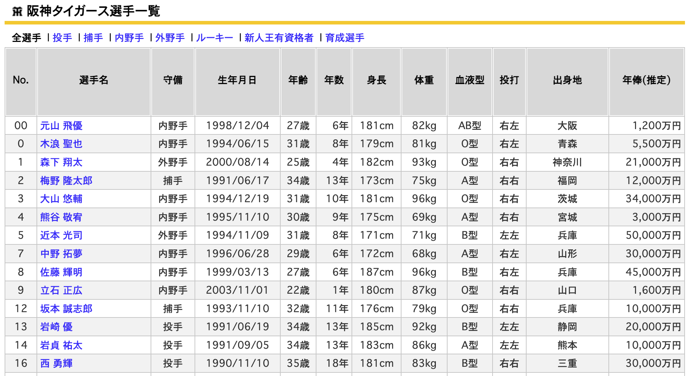
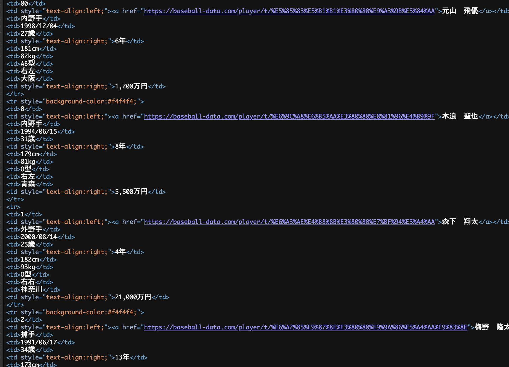

```{r include = FALSE}
knitr::opts_chunk$set(fig.align = 'center', message = F, warning = F)
```

***
**<span style="color:blue">今回の内容</span>**

- データ構造の基礎

- 構造化データ用のオブジェクト

- 課題の提出方法

***


# データ構造の基礎

前回の授業で説明したように、データ構造(data structure)にも、データの保存形式や形状に着目するデータサイエンス的な分類と、確率的な生成過程や分析手法に着目する統計学的な分類の2つの視点が存在する。

## 統計学において
統計学の分類として、

- 横断面データ(Cross-sectional data)<br>
ある時点の個体データ$x_{i}$

  - 2025年47都道府県の公的教育支出

  - 令和7年国勢調査(個人を対象)
  
  - 令和6年経済センサス(事業所・企業を対象) etc.
  
  
- 時系列データ(Time series data)<br>
時間の経過とともに観察されたデータ$x_{t}$

  - 株価
  
  - 天気予報
  
  - GDP推移 etc.
  
- パネルデータ(Panel data/Longitudinal data)<br>
同じ個体を複数の時点にわたって観測したデータ$x_{it}$

  - 都道府県ごとの消費者物価指数の年次データ
  
  - 日本家計パネル調査
  
横断面データ、時系列データとパネルデータはいずれもexcelのような表形式で保存・扱われている。オーソドックスな経済学・統計学に使われるデータのほとんどがこのような**構造化データ**。

横断面データ、時系列データやパネルデータの違いを理解するため、まず下記のpackagesを読み込むこと。初回はインストールする必要がある。

```{r}
# 必要なパッケージ（初回のみインストール）
# install.packages(c("plm", "AER", "wooldridge", "tydyverse"))
 
library(plm)        # パネルデータ分析
library(AER)        # 経済学データセット
library(wooldridge) # Wooldridge教科書のデータ
library(tidyverse)
```
### 横断面データ
(1)AERパッケージにあるカリフォルニア州学区の学力データを開いてみると、各行が「1つの学区」 = 個体 i、時間の次元がない。

```{r}
data("CASchools", package = "AER")
head(CASchools)

# データ型を確認
str(CASchools)


# 簡単な散布図：生徒/教員比 vs テストスコア
CASchools$score <- (CASchools$read + CASchools$math) / 2
plot(CASchools$student/CASchools$teachers, CASchools$score,
     xlab = "Student/Teacher Ratio", ylab = "Average Test Score",)
```

(2)仮想の都道府県別データを生成する
```{r}
set.seed(123)
prefectures <- c("北海道","青森","岩手","宮城","秋田","山形","福島","茨城",
                 "栃木","群馬","埼玉","千葉","東京","神奈川","新潟","富山")
cross_jp <- data.frame(
  pref       = prefectures,
  population = round(runif(16, 100, 1400), 1),   # 人口
  gdp_per_capita = round(rnorm(16, 380, 60), 1), # 一人当たりGDP
  edu_spend  = round(rnorm(16, 250, 40), 1)      # 教育支出
)
head(cross_jp)
```

一行は一都道府県、時間の概念はデータにない(時間が固定されている)。実際の横断面データは、個人レベル、企業レベル、都道府県レベル、市区町村レベル、国レベルなど様々ある。

横断面データでは、観測単位（行）の順序は本質的な意味を持たないため、並び替えても統計的性質は変わらない。


### 時系列データ

(1)ここでは、Rに内蔵されている月次航空旅客数データを使用する。日付を示す変数以外、一本の時系列データだけが存在する。時系列は上から下まで時間順に並び、順番を変えてはいけない。

```{r}
library(zoo)

air <- data.frame(
  date = as.yearmon(time(AirPassengers)),
  passengers = as.numeric(AirPassengers)
)

head(air)

# データ型
str(air)
```

時系列データに必ず日付型の変数が存在する。実務上、年次データ、四半期データ、月次データ、日次データ、高頻度データ(High-Frequency Data、ミリ秒やマイクロ秒ごとのデータなど)などがある。

(2)次はNile川の年間流量のデータを使う

```{r}
data(Nile)
print(Nile)
plot(Nile)
```

Nile川のデータも時系列データだか、`data.frame`オブジェクト(後述)として保存されていないため、「一列」ではないように見える。Rの中に、時系列データを処理できるオブジェクトは様々ある、場合によって使い分けが必要である。

Nileデータは1871-1970の1年間隔のデータ、1871年は1とし、1872年は2、1873年は3...なため、「日付」はないように見えるが、データ属性上は存在する。ただし、軽量な扱いやすい`ts`オブジェクトを使っているだけである。

(3)`quantmod`パッケージの下、さまざまな株価時系列データがある。例えば、日経平均225

```{r}
# 必要なパッケージ（初回のみインストール）
# install.packages("quantmod")
library(quantmod)
getSymbols("^N225", src = "yahoo", to = "2026-04-01")  # 日経平均
chartSeries(N225)
head(N225)
class(N225)
```

```{r}
toyota <- getSymbols("7203.T", src = "yahoo", auto.assign = FALSE)
chartSeries(toyota)
```
個別株の時系列を確認するには、 (日本では)4桁の証券コードが必要。例えば、トヨタの場合は7203。
詳細は[Yahooファイナンス](https://finance.yahoo.co.jp/)をチェック。`quantmod`では日本株や米国株のデータを簡単に利用できるため、時系列研究したい人はぜひ利活用してください。


### パネルデータ

(1)パネルデータは二つの軸(個体×時間)を持つ。ここで、企業レベルのパネルデータ`Grunfeld`を読み込むと、
```{r}
data("Grunfeld", package = "plm")
head(Grunfeld, 50)
table(Grunfeld$firm, Grunfeld$year)
```
企業(firm)×年(year)のクロス表を出すと、10企業が1935から1954かけて毎年、追跡調査されたことがわかる。

パネルデータであることをRに宣言する必要がある。個体と時間を指定して、

```{r}
Grunfeld_df <- pdata.frame(Grunfeld, index = c("firm", "year"))
pdim(Grunfeld_df)
```

`pdim`はパネルデータの次元を確認する関数であり、`n=10, T=20, N=200`10個の企業を20年間にわたって追跡したデータを確認した。

```{r}
ggplot(Grunfeld, aes(x = year, y = inv, color = factor(firm))) +
  geom_line() +
  labs(title = "Investment trends across firms",
       x = "Year (t)", y = "Investment (i)",
       color = "Firm") +
  theme_minimal()
```

上記のように、企業ごとの投資額の推移を描くことができる。同じ個体を複数時点にわたって記録する構造は明白である。

(2)仮想の都道府県別消費者物価指数の推移データ

```{r}
panel_jp <- data.frame(
  pref = rep(c("東京","大阪","愛知","福岡","北海道"), each = 10),
  year = rep(2015:2024, times = 5)
) %>%
  mutate(
    cpi = 100 +
      as.numeric(factor(pref)) * 0.5 +
      (year - 2015) * 0.8 +
      rnorm(n(), 0, 0.5)
  )

head(panel_jp,20)
```
この仮想データでは、年々物価が上昇し、インフレ状態になっている。5都道府県を10年間追跡するデータである。

### まとめ

| データ構造 | 観測単位 | インデックス | 例 |
|:----------|:--------|:-----|:---------|
| 横断面 Cross-section | 個体 × 変数 | i | 2015年都道府県別の所得|
| 時系列 Time series   | 時点 × 変数 | t | 日経平均（日次） |
| パネル Panel         | 個体 × 時点 × 変数 | (i, t) | 都道府県別の年次推移 |

横断面、時系列やパネルデータは統計学・計量経済学における基本的かつ重要なデータ構造である。この三つのデータ構造は、必ず覚えておきましょう。構造化されたデータのため、excelのような行×列の形式である。一行は一観測、一列は一変数。

## データサイエンスにおいて
  
データサイエンスの分類として、

  - 構造化データ(Structured data)<br>
  表形式データ(csv, Excel, SQLデータベースなど)
    - data.frameオブジェクト
    
    
  - 半構造化データ(Semi-structured data)<br>
  JavaのJSONやhtmlが半構造データの典型であるが、Rの中ではlistオブジェクトが似ている。<br>
  一定の構造が見えるが、構造化データの厳密な行×列のようなものではない。
    - listオブジェクト
  
  
  - 非構造データ(Unstructured data)<br>
  テキスト、画像、音声、映像など表形式に収まらないデータ

Rプログラミング入門は主に構造化データ用のdata.frameオブジェクトとその変形、および時系列データを扱うオブジェクトを説明する。

### 構造化データ

前述した横断面データ、時系列データ、およびパネルデータは、多くの場合、`data.frame`オブジェクトとして保存・処理される。詳細は[次の節](#データ構造用のオブジェクト)を確認すること。

統計分析において、最も重要なオブジェクトである。行×列の構造。

### 半構造データ
(1)api経由で下記jsonデータを取得したとする。(ネット上、よくあるデータ形式)
```json
{
  "firstName": "John",
  "lastName": "Smith",
  "address": {
      "streetAddress": "5th Avenue, 101",
      "city": "New York",
      "postalCode": 10001
  },
  "phoneNumbers": [
      "800-123-4444",
      "800-123-5555"
  ]
}
```


jsonデータをRの**listオブジェクト**に変換したら、xはExcelのような単一の列ベクトルではなく、文字列・数値・ベクトル・リストなど異なるデータ型を同時に保持できるリスト構造を持つ。

```{r}
x <- list(
  firstName = "John",
  lastName  = "Smith",
  address = list(
    streetAddress = "5th Avenue, 101",
    city = "New York",
    postalCode = 10001
  ),
  phoneNumbers = c("800-123-4444", "800-123-5555")
)
str(x)
```

`list`オブジェクトは、異なるデータ型のオブジェクトをまとめて格納できるため、プロジェクト管理に役立つことがある。通常、作成したオブジェクトはすべてRStudioの環境欄(Environmentペ)に表示される。そのため、分析対象が増えると、作業環境が雑然として見づらくなる。このような場合、関連するオブジェクトを1つの`list`にまとめて保存すると、整理しやすくなる。

(2)下記の野球データも半構造のhtmlである。
https://baseball-data.com/player/t/




見た目上はexcelのように整理されているが、



中身は様々なタグで構成されたHTMLデータである。選手の「データ」は特定のタグ内に記述されているが、Excelのようなセル形式ではない。

従来はHTMLの知識がなければデータ抽出は困難であったが、AIの進展によりこの分野は大きく変化している。例えば、スクリーンショットをAIに入力し、「CSV形式に整理せよ」と指示することで、非構造化データを比較的容易に構造化データへ変換することが可能になっている。本授業では非構造化データの詳細な扱いは省略し、必要に応じてAIの活用を推奨する。

```{r, echo=FALSE}
baseball <- data.frame(
  No        = c("00","0","1","2","3","4","5","7","8","9"),
  name      = c("元山飛優","木浪聖也","森下翔太","梅野隆太郎","大山悠輔","熊谷敬宥","近本光司","中野拓夢","佐藤輝明","立石正広"),
  pos       = c("内野手","内野手","外野手","捕手","内野手","内野手","外野手","内野手","内野手","内野手"),
  birth     = c("1998/12/04","1994/06/15","2000/08/14","1991/06/17","1994/12/19","1995/11/10","1994/11/09","1996/06/28","1999/03/13","2003/11/01"),
  age       = c(27,31,25,34,31,30,31,29,27,22),
  exp       = c(6,8,4,13,10,9,8,6,6,1),
  height    = c(181,179,182,173,181,175,171,172,187,180),
  weight    = c(82,81,93,75,96,69,71,68,96,87),
  blood     = c("AB","O","O","A","O","A","B","A","B","O"),
  bat_throw = c("右左","右左","右右","右右","右右","右右","左左","右左","右左","右右"),
  origin    = c("大阪","青森","神奈川","福岡","茨城","宮城","兵庫","山形","兵庫","山口"),
  salary    = c(1200,5500,21000,12000,34000,3000,50000,30000,45000,1600)
)

baseball
```
上記は、半構造化データから構造化された野球データの例であり、表形式として整理されている。

### 非構造データ

Rでも非構造化データを扱うことは可能であるが、  実務や研究においては、音声・画像・映像データの処理は Python が主に用いられる。この授業では、非構造化データの扱いは省略するが、例えば、映像データのような非構造化データに対して関節点を検出し、その位置を時系列として記録することで、構造化データへ変換することができる。

<video width="600" controls>
  <source src="http://ztempest0218.github.io/img/nakai.mov" type="video/mp4">
</video>

# 構造化データ用のオブジェクト
前回は小さいデータを保存・処理するベクトル、行列を紹介した。

## data.frameオブジェクト
`data.frame`は、Rにおける最も基本的な表形式データ構造である。列ごとにデータ型が違ってもよい表形式のオブジェクトである。ただし、各列は同じ長さのベクトルであり、excelの1シートに似ている。

下記のように、`data.frame()`の括弧の中に、ベクトルを作成することができる。ここでは、その結果を`df`という名前で保存する。
```{r}
df <- data.frame(
  id      = c(1, 2, 3, 4, 5),
  name    = c("田中", "佐藤", "鈴木", "高橋", "伊藤"),
  score   = c(85, 72, 90, 65, 78),
  passed  = c(TRUE, TRUE, TRUE, FALSE, TRUE)
)
head(df)
```
Rでは、`<-`と`=`はどちらでも代入として動くが、オブジェクトを扱う際には必ず`<-`を使用、`=`を乱用しないでください。関数の中だけ、`=`を使用してください。上記、`id,name,score,passed`は`data.frame`関数の中にあるため、`=`を使用した。


または、ベクトルを作成してから、`data.frame()`でデータを構成することもできる。この場合、`<-`を使用する。

```{r}
id        <- c(1, 2, 3, 4, 5)
name      <- c("田中", "佐藤", "鈴木", "高橋", "伊藤")
score     <- c(85, 72, 90, 65, 78)
passed    <- c(TRUE, TRUE, TRUE, FALSE, TRUE)
df2 <- data.frame(id, name, score, passed)
```

```{r}
# 次元(行×列)
dim(df)

# 列名の確認(変数)
names(df)

# データ型の確認
str(df)

# 各変数の要約統計
summary(df)

```
### 列を取り出す

`$`ドルマーク演算子を使って、`data.frame` オブジェクトの中の列を呼び出すことができる。ここでは、`df`中の`score`変数を一列を取り出す。

```{r}
df$score

df[, "score"] 

```

上記以外にもさまざまな書き方が存在するが、ここでは最も扱いやすい方法のみを示す。

### 複数列をまとめて

下記のように、dfの一部の列から新しいオブジェクトを作成することができる。
```{r}
a <- df[, c("name", "score", "passed")]
head(a)
```

### 行を取り出す

```{r}
df[1, ]                    # 1行目
df[c(1, 5, 10), ]          # 1, 5, 10行目
df[1:5, ]                  # 1〜5行目    
df[df$score > 80, ]        # >80の人を抽出
```

### 行+列を同時に取り出す
```{r}
df[1:3, c("name", "score")]
```

### 列を作成・削除する

```{r}
df$over80  <- ifelse(df$score >= 80, 1, 0)
df$score2 <- df$score * 1.1
df
```

```{r}
df$passed <- NULL
```

条件付きのデータ抽出(行データの操作)や、変数を用いた計算(列データの操作)、練習を通じて習得しておくことが望ましい。

# 課題
課題リンクをクリックする前に、Githubチュートリアルを視聴してください。[Githubのイメージ](./004-data-structure/github.png)

https://zoom.us/rec/share/H4OSwQ3ljjDx7fykOq8uTFP1AXH15ha28cURYwWhmFerk0R4gPOAoJ6aR5p0OULf.i9HYIOxd-lXNAbve

Passcode: a%4H?7S@

To-Doリスト

  1. Github Desktopをインストール(ガイダンスを参考)
  
  2. 2段階認証を登録 https://drive.google.com/file/d/1l3gKPgRnLeF7Mp9-EoZ6ifHqczD7z6R3/view?usp=sharing
  
  3. Githubから課題を受領する [文字版](https://docs.google.com/document/d/1L528tvVoiTqf04mgQEPtexdsxHDYOEFy0XeHNPX8olw/edit?usp=sharing)
  
  4. パソコンLocal環境で課題を取り組む
  
  5. 課題をGithubサーバーに提出(push)する

HW1とHW2の〆切は2026年5月13日16:30までです。

HW1 https://classroom.github.com/a/dQba4t97<br>
HW2 https://classroom.github.com/a/Vt8PPngF


