```{r include = FALSE}
knitr::opts_chunk$set(fig.align = 'center', message = F, warning = F)
```

***
**<span style="color:blue">今回の内容</span>**

- データの読み込み

  - **csv**（最も汎用的で重要なデータ形式）
  
  - excel
  
  - rds
  
  - Parquet（ビッグデータやクラウドでは標準的形式）
  

- 前処理

  - **データheaderの前処理**

  - tidyverseとdplyr(次回)
  
**<span style="color:blue">今回使用するデータ</span>**

1. crime1.csv、crime1.txt（Wooldridge犯罪データ）

2. tigers_2026.csv（阪神全選手データ）

3. excel.xlsx（テスト用）

4. yellow_tripdata_2025-01.parquet（NYC Taxiビッグデータ）

5. SSDSE-B-2026.csv（教育用標準データセット 統計センター）<br>
  総務省主催「統計データ分析コンペティション」指定データ

上記データを[Rプログラミング入門授業用サイト](https://ztempest0218.github.io/R-Programming/)からダウンロードしてください。

***


# データの読み込み

Rの学習において、データ導入は多くの文系学生にとって最初の壁である。Excelのようにクリックするだけでファイルを開けるわけではなく、working directoryの設定やファイル形式の理解、文字化けへの対応など、細かな実務的問題が障壁となる。

ここでは、よく用いられるCSV、Excel、RDS、およびParquetについて解説する。

## csvの読み込み
CSV とは Comma-Separated Values の略であり、カンマ`,`で値を区切って、表形式のデータを保存するテキストファイルである。構造が非常にシンプルで、Windows のメモ帳などのテキストエディタでも開くことができる。そのため、特別なソフトを必要とせず、1970年代から現在まで使われ続けている、息の長いデータ形式である。

csvファイルをテキストエディタで開く場合
```
name,age,sex
Taro,20,M
Hanako,21,F
Jiro,19,M
Yuki,22,F
Ken,21,M
Sakura,20,F
```

Excelなどの表計算ソフトで開くと、自動的にカンマ区切りが認識されるため

| name　　| age | sex |
|:--------|:----|:----|
| Taro    | 20  | M   |
| Hanako  | 21  | F   |
| Jiro    | 19  | M   |
| Yuki    | 22  | F   |
| Ken     | 21  | M   |
| Sakura  | 20  | F   |

- 行（row）＝観測値（observation）
- 列（column）＝変数（variable）

という統計分析で標準的な「構造化データ」として表示される。CSVをRに導入すると、data.frameオブジェクトとして扱う。

**①標準的なCSVファイルには、データそのもの（数値や文字列）のみが記録され**ており、**②変数の意味や単位、定義などを記述したcodebook**は通常、別途作成・管理される。

例えば、日本家計パネル調査(JHPS/KHPS)の場合、数千に及ぶ変数が含まれており、データだけを見てもその内容を直ちに理解することは難しい。基本的には、CSVデータを確認しながらcodebookを参照し、対応関係を把握した上でデータ前処理を行う必要がある。
e.g.BMIを計算する場合には、codebookを用いて身長および体重に対応する変数名を特定し、それらをCSVデータから抽出した上で計算を行う。なお、必要に応じて**③調査票（questionnaire）**を併用することも多い。

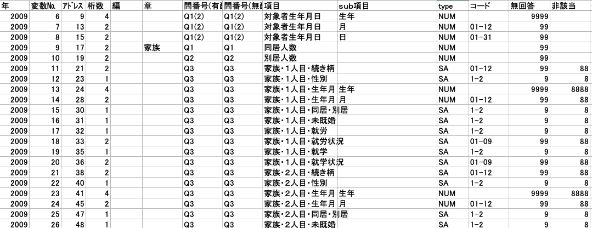

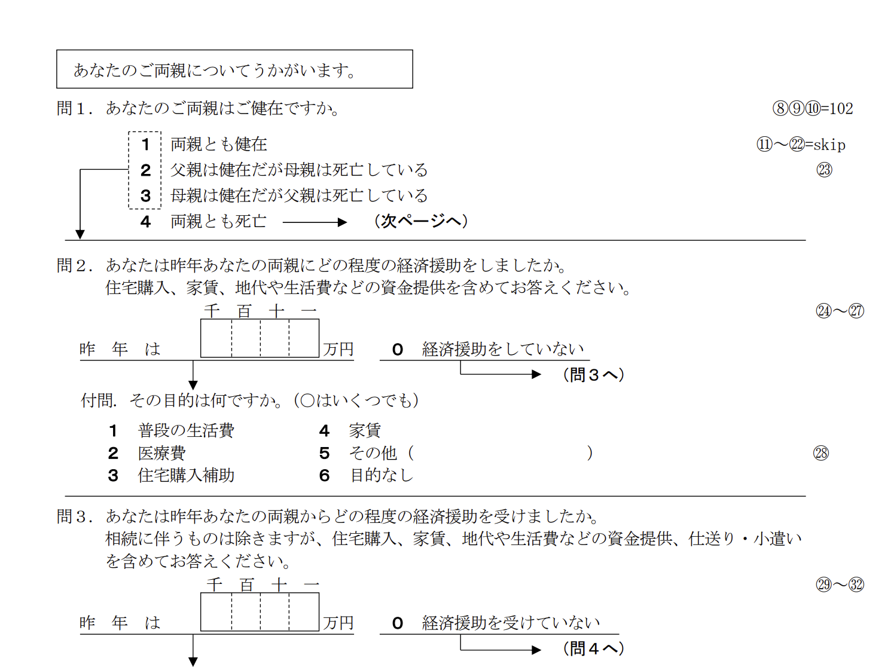

授業で扱うデータセットは規模が比較的小さいため、データの説明にcodebookを用いる機会は多くない。しかし、実務や研究においては、codebookを参照しながらデータを扱うことが統計調査における標準的な方法である。

- Panel Study of Income Dynamics（PSID）

- National Longitudinal Surveys（NLS）

- 日本家計パネル調査（JHPS/KHPS）

- Trends in International Mathematics and Science Study（TIMSS）

- etc.

近年利用が広がっている Kaggle や GitHub などのプラットフォーム上のデータでは、必ずしも codebook が付与されているとは限らない。特に、変数(列)は少ない一方で観測値(observation)が多いデータセットでは、`age`、`sex`、`labor_supply_time` のように、変数名そのものから内容を推測しやすい形で整理されていることも多い。

例えば、Kaggle 上の[NBA Players stats since 1950](https://www.kaggle.com/datasets/drgilermo/nba-players-stats?select=Players.csv#) というデータセットでは、特に独立した codebook は用意されていない。しかし、Players.csv を確認すると、変数名の下に簡単な説明文が加えられており、各変数のおおよその意味を把握できるようになっている。

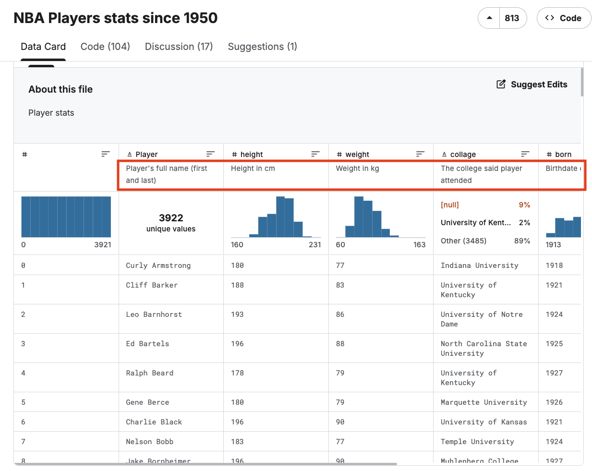

(1)次はwooldridge犯罪データ`crime1.csv`を読み込んで、csvの中身を確認しよう。

```{r}
# Working directory は各自の環境に応じて適宜設定すること
# ここでは例として Desktop を working directory に設定し、使用するデータはすべて dataフォルダに保存するものとする。

crime <- read.csv("./data/crime1.csv", header = TRUE)

head(crime)
```

Rでは、`read.csv()`を用いてパスを指定することで、csvファイルを簡単に読み込み、`data.frame`として保存することができる。`header = TRUE`を指定すると、csvデータの1行目を変数名として読み込むことができる。`header = FALSE`を指定すると、本来は変数名である1行目もデータとして読み込まれるため、文字列を含む余計な観測値が追加されることになる。

`header`の設定は、元のcsvデータに変数名が含まれているかどうかによって決まる。元のデータを確認してみよう。

```{r}
summary(crime)
```

データ上に特に問題がない場合は、複雑な前処理を行わなくても、すぐに記述統計量などを計算し、データの基本的な属性を確認することができる。ただし、海外データでは変数名に英文の略称が用いられていることが多く、`narr86`、`nfarr86`、`nparr86` ...など、codebookを確認しなければ意味がわからない場合も多い。

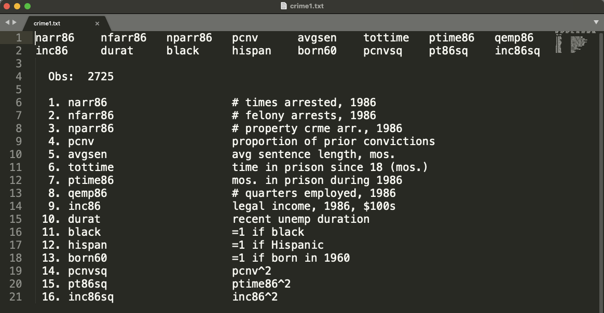

`crime1.txt`のcodebookを確認すると、`narr86`は1986年に逮捕された回数、`nfarr86`は1986年に重罪（felony）で逮捕された回数、`nparr86`は1986年に財産犯（property crime）で逮捕された回数である。データ分析において codebook の確認は非常に重要である。

```{r}
# 合法的収入と逮捕された回数との関係
plot(
  crime$inc86,
  crime$narr86,
  xlab = "Legal Income in 1986",
  ylab = "Number of arrests in 1986"
)

model <- lm(narr86 ~ inc86, data = crime)
abline(model, col = "red", lwd = 3)
```

ここでは、`crime1.csv` データを用いて、若者男性の犯罪活動について分析してみる。ノーベル経済学賞受賞者である Gary Becker（1930–2014）の犯罪経済学の理論は非常に有名であり、従来は数値化が難しいと考えられていた犯罪活動を、ミクロ経済学のフレームワークの下で分析可能にした。彼の理論において重要なポイントは、「機会費用」を考えることである。<u>合法的な収入を持つ人は、犯罪を行った場合に失うものが大きく、万が一逮捕・処罰されれば人生が大きく崩れる。そのため、社会的・経済的水準の低い人に比べて、犯罪を行う確率は低くなると予測される。</u>上図は、逮捕回数と合法的収入の関係を示した散布図である。赤線は線形フィットを表しており、合法的収入が高いほど、逮捕回数が少ない傾向が確認できる。（なお、ここでは線形モデルの妥当性についてはひとまず考慮しない。実際には、犯罪を行わない人が多く、逮捕回数は非負の計数データであるため、Poisson回帰や負の二項回帰を用いて分析するほうが適切であろう。）

余計な話かもしれないが、<u>データ分析においては「理論」の存在が非常に重要</u>である。単にデータを見るだけではなく、データを用いて理論を検証し、その妥当性を確認・改善していくことに大きな意味がある。一方で、学部生の分析では、理論的背景を十分に考えず、適当に変数を選んで分析を行い、結果をうまく解釈できないケースも少なくない。データ分析では統計手法だけでなく、経済学や犯罪学など他分野の前提知識も非常に重要である。**結果を解釈する能力**がすべてである。


(2)次は日本語が入っているCSVを導入してみよう。`tigers_2026.csv`が阪神選手のデータである。

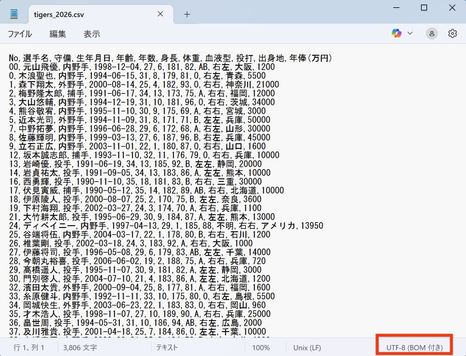

メモ帳などのテキストエディタで開いてみると、このcsvファイルが `UTF-8` 形式でエンコードされていることが分かる。現在では、Rにcsvファイルを導入する際、多くの場合はエンコードが自動的に認識され、日本語も問題なく読み込めることが多い。しかし、以前は文字化けの問題が頻繁に発生していた。そのため、現在でも `encoding` を明示的に指定して読み込むことが推奨される。

```{r}
tigers <- read.csv("./data/tigers_2026.csv", fileEncoding = "UTF-8", header = TRUE)
head(tigers)
```

パソコンの環境によっては、`fileEncoding = "UTF-8"` を指定しない場合、日本語が文字化けすることがある。

```{r}
tigers$選手名
```

このデータを確認すると、大きな問題は見られない。しかし、変数名が日本語で書かれているため、coding の際にはやや不便である。選手名を確認するには、`tigers$選手名`で途中日本語入力に切り替える必要がある。特に、全角スペースなどを誤って入力してしまうリスクが高くなる。そのため、一般的には変数名を英数字で統一することが推奨されており、これは国際的にも標準的な慣習である。


```{r}
# tigersというdata.frameオブジェクトの変数名を一括変更
names(tigers) <- c(
  "no",
  "name",
  "position",
  "birthdate",
  "age",
  "exp",
  "height",
  "weight",
  "blood",
  "b/t",
  "birthplace",
  "salary"
)

head(tigers)
```
ベクトル表記 `c()` を用いることで、変数名のベクトルを作成し、複数の変数名を一括で変更することができる。ただし、変数名は列の順番に対応しているため、順番を間違えないように十分注意する必要がある。

```{r}
# 個別に変数名を変更
names(tigers)[6] <- "experience"
```

個別に変数名を変更することもできる。上記のコードは6列目を`experience`に変更した。`[]`角括弧で列番号を指定すれば良い。

```{r}
tigers$blood <- as.factor(tigers$blood)
model <- lm(salary ~ blood, data = tigers)
summary(model)
```

血液型が野球選手の年俸に分析してみる。阪神では、(A型に比べると)、<u>B型の年俸は平均的に7455.1万高い</u>。

### 文字化け問題

実務において、**日本語を含むCSVデータ**を扱う際には、文字化けがしばしば発生する。これは、コンピュータ上で文字列をどのように数値として表現するかという文字コード（エンコード）の違いによる問題である。代表的な文字コードとして、ASCII、UTF-8、Shift-JISなどがある。

[文字コード変換サイト](https://www.ahref.org/mojicode.php)を用いて、文字コードの違いを確認してみよう。同じ単語であっても、UTF-8とShift-JISではパソコン内部の表現が異なるため、**保存時と読み込み時の文字コードが一致しない**場合、正しく表示されず文字化けが発生する。よくある事例としては、UTF-8で保存されたファイルをShift-JISとして開いてしまったり、逆にShift-JISで保存されたファイルをUTF-8として読み込んでしまう場合が多い。

```r
# ラーメン

# UTF-8
e3 83 a9 e3 83 bc e3 83 a1 e3 83 b3

# Shift-JIS
83 89 81 5b 83 81 83 93
```
上記のように、「ラーメン」の中身である。計算機上単なる数値列である。

授業ではこれ以上は扱わないが、<u>各自の研究において文字化けが発生した場合には、手元のデータがUTF-8で保存されているのか、それともShift-JISで保存されているのかを確認すること</u>が重要である。Windowsの日本語環境では、デフォルトでShift-JIS（正確にはその拡張であるCP932）が用いられるため、UTF-8のデータを扱う際に文字化けやエラーが生じることがある。

多言語間の互換性を考えると、UTF-8一択である。日本語、中国語、韓国語、英語など、世界中のほぼすべての文字を統一的に扱うことができる。さらに、Linux、Mac、Web、Python、R、データベースなど、現代の情報システムの多くがUTF-8を標準として採用している。

- UTF-8で保存
- UTF-8で読み込む

Shift-JISでエンコードされた日本語データも、UTF-8へ変換して保存することが推奨される。

## excelの読み込み
基本的に、この授業ではデータ分析では **Excel 形式のファイルの使用はあまり推奨されない**。Excel は手動編集が容易である一方、データ構造が壊れやすく、再現性の低下につながるためである。

Excel形式（いわゆる.xlsx拡張子）で保存されたデータは、データサイエンスの分野ではCSVなどに比べて使用頻度はかなり低いが、産業界や一部の研究環境においては依然として利用されている。そのため、Excelを用いたデータ管理を行う研究者や組織と共同作業を行う場合には、Excel形式のデータの取り扱いにも慣れておくことが重要かもしれない。

Excel形式の特徴として、**Sheet機能**があり、一つのファイル内で複数のデータを管理することができる。 Sheetをクリックして、切り替えることができる。一方で、データ量が大きくなると動作速度が低下し、ファイル自体も重くなりやすい。複数のSheetを持つexcelファイルを導入する場合、Sheet名を指定する必要がある。

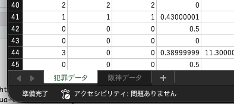

`excel.xlsx`ファイルにwooldridge犯罪データと阪神データを保存している。Rに導入してみよう。

```{r}
# 初回のみreadxlパッケージをインストール
# install.packages("readxl")

# readxlパッケージを読み込む
library(readxl)

df1 <- read_excel("./data/excel.xlsx", sheet = "犯罪データ")
df2 <- read_excel("./data/excel.xlsx", sheet = "阪神データ")
```

Excelファイルを導入する場合、header に関する設定を明示的に行う必要はなく、1行目が自動的に検出され、変数名として設定される。ただし、元データの1行目が変数名ではない場合は、`col_names = FALSE` を指定する必要がある。

Excel の扱いについてはこれ以上詳しく扱わない。文字化けが起こりにくいというメリットはあるものの、標準的なデータ形式ではない。誤操作（または意図的改竄）によってデータ構造を破壊してしまうリスクが高い。R に導入して `data.frame` オブジェクトを作成した後の処理方法は、csv データの場合と基本的に同様である。

## rdsの保存・読み込み

`rds` は、Rオブジェクトをそのまま保存するための**R専用データ形式**である。  csvのような汎用形式とは異なり、`data.frame` だけでなく、モデル推定結果や list、関数なども保存することができる。

メリットとしては、

- **<span style="color:blue">Rオブジェクト</span>**（データ以外も）をそのまま保存できる

- 変数型（numeric, factor など）が保持される

- csv より高速に読み込み可能

- ファイルサイズが小さいことが多い

一方で、R専用形式であるため、Excel やメモ帳では開くことができず、他ソフトとの互換性は低い。ただし、データ分析における**中間計算物を保存**したり、後から繰り返し利用したりする際に非常に便利である。生の csvデータから毎回最初から前処理や計算をやり直す必要がなくなる。

```r
# 阪神データの前処理・分析
rm(list = ls()) # メモリーを空にする

tigers <- read.csv("./data/tigers_2026.csv", fileEncoding = "UTF-8", header = TRUE)

names(tigers) <- c(
  "no",
  "name",
  "position",
  "birthdate",
  "age",
  "exp",
  "height",
  "weight",
  "blood",
  "b/t",
  "birthplace",
  "salary"
)


head(tigers)

names(tigers)[6] <- "experience"

tigers$blood <- as.factor(tigers$blood)
model <- lm(salary ~ blood, data = tigers)
summary(model)
```

ここでは、先ほど使用した阪神データをもう一度利用し、RDS形式での保存と読み込みを行ってみる。上記コードが正しく実行されると、Environment には `model`（線形回帰モデルの推定結果）と `tigers`（阪神データの `data.frame` オブジェクト）が表示される。

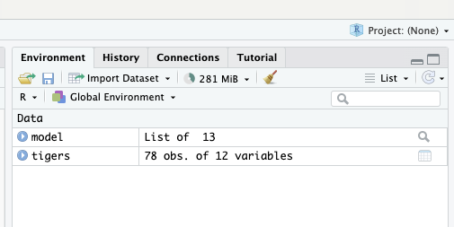
```{r}
saveRDS(tigers, "./data/tigers.rds")
saveRDS(model, "./data/model.rds")
```

`saveRDS()` では、保存したいオブジェクトと保存先のファイル名を指定することで、簡単に R オブジェクトを保存することができる。

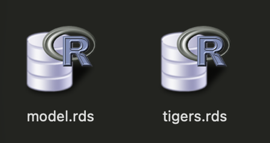{width=30%}

```{r}
rm(list = ls()) # メモリーを空にする
tigers <- readRDS("./data/tigers.rds")
```
`readRDS()` を用いることで、RDS形式で保存された `data.frame` オブジェクトを正常に読み込むことができた。

```{r}
rm(list = ls()) # メモリーを空にする
model <- readRDS("./data/model.rds")
```
推定結果もを正常に読み込むことができた。

rds 形式では、R の任意のオブジェクトを保存できるため、研究やデータ分析の柔軟性を高めることができる。例えば、長時間かけて汚いデータを整理・前処理した場合でも、元の csv データを保持したまま（書き換えることなく）、中間計算結果や整形済みデータを保存して再利用することができる。**研究の再現性**が優れている。

**科学的研究**において、生データを直接編集・変更し、元に戻せない状態にしてしまうことは、場合によっては研究不正とみなされる可能性がある。そのため、基本的には<u>生データそのものを編集せず</u>、R に導入した後に作成されるオブジェクト上で前処理や分析を行うことが推奨される。つまり、生データには一切手を加えず、分析作業はすべて複製されたオブジェクト上で実施するのである。

授業では小さいデータを使うため、rdsを使用する機会はそれほど多くないが、**個人研究では積極的に活用してほしい**。

## Parquetとは

CSV は行指向（row-based）の保存形式であり、データを1行ずつカンマ`,`で区切る形で保存している。

```
name,age,salary,height,weight
Taro,20,300,170,60
Hanako,21,400,158,48
Jiro,19,280,175,68
Yuki,22,450,162,52
Ken,21,500,180,75
Sakura,20,320,155,45
Daichi,23,600,178,72
Mika,22,420,160,50
Ryo,24,550,182,78
Aoi,19,290,157,46
...
```
上記の例では、名前、年齢、収入、身長、体重などの変数を含む csv データである。仮に我々が収入 `salary` のみに興味を持つ場合でも、csv 形式では一度すべての行データを読み込んだ上で、必要な列を抽出することになる。そのため、国勢調査データや POS データのような大規模データを読み込む場合には、処理速度がかなり遅いのである。CSV は、そもそも半世紀以上前に開発された非常に古いデータ形式である。

Parquet は、Apache Parquet によって開発された列指向（columnar）データ形式であり、**大規模データ分析やクラウド環境**で広く利用されている。csv と比較して読み込み速度が高速であり、圧縮率も高い。原理的には、

```
salary
300
400
280
450
500
320
600
420
550
290
...
```

Parquet は列単位でデータを保存・読み込みする形式である。そのため、例えば収入 `salary` の列だけを直接読み込み、平均収入を計算することができる。csv のように、すべての観測値を1行ずつ読み込む必要はない。ただし、学部生にとってはビッグデータに触れる機会がかなり少ないため、Parquet 形式はやや馴染みの薄いデータ形式かもしれない。


R では、通常 `arrow` パッケージを用いてParquet読み込む。ここでは、NYC Taxiビッグデータでやってみる。NYC Taxi データは、都市経済学、交通経済学、GIS、機械学習、Big Data 教育など幅広い分野で利用されている。特に、巨大かつリアルなデータセットであるため、Data Science 教育の代表的教材として有名である。

```{r}
# arrowパッケージを読み込む
library(arrow)

taxi <- read_parquet("./data/yellow_tripdata_2025-01.parquet")

nrow(taxi) #観測値(行数)を確認
```

2025年1月のタクシーデータは、一ヶ月分だけで 3,475,226 行もある大規模データである。

Excelには、1シートあたり 1,048,576 行、16,384 列という上限がある。そのため、数百万行以上のデータや、列数が非常に多いデータを扱う場合、Excelだけで処理することは現実的ではない。データサイエンスでは、このような大規模データをRやPythonで処理することが多い。

```{r}
# 時間帯別にみるタクシー利用量
library(dplyr)
library(ggplot2)
library(lubridate)

taxi_hour <- taxi %>%
  mutate(hour = hour(tpep_pickup_datetime)) %>%
  count(hour)

ggplot(taxi_hour, aes(x = hour, y = n)) +
  geom_col() +
  labs(
    title = "NYC Yellow Taxi Trips by Hour",
    x = "Hour of Day",
    y = "Number of Trips"
  ) +
  theme_minimal()
```
上図は、NYC Taxiデータを用いて、1時間単位でタクシー利用件数を集計した結果である。図から、10時から15時にかけて利用件数が相対的に少なく、日中のこの時間帯がタクシー需要の谷になっていることが分かる。<u>`dplyr`パッケージやパイプ演算子`%>%`は次回の授業で解説</u>する。

大規模データを扱うには一定のパソコン性能が必要であるため、授業では主に小規模なデータを利用する。ただし、ビッグデータに興味がある人や、データサイエンス分野への進路を考えている人は、Parquet形式のデータを探し、RやPythonで実際に読み込んで分析してみるとよい。NYC Taxiデータ以外にも、Lending Club Loan Data のように、借入金額、金利、毎月の返済額、返済状況、債務所得比率などを含むデータがある。数百万人規模のデータを用いて、金融分野における信用リスク分析やデフォルト予測を行うことができる。大規模データであっても、CSV形式で保存されていることは多い。そのような場合、RでCSVファイルを読み込んだうえで、`write_parquet()` を用いてParquet形式として保存することができる。

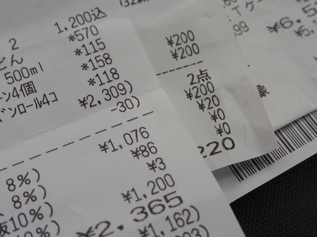{width=30%}

レシート・POSビッグデータは、消費者需要の推定やキャンペーン・広告効果の測定などに非常に役立つ。日本においては主に法人向けサービスとして提供されており、学部生が入手すること難しい。一部の大学研究では、地元のスーパーマーケットと交渉し、POSデータの提供を受ける事例もある。このような秒単位で生成されるビッグデータでは、Parquet形式を用いて処理することが一般的である。

# データの前処理
## 基本: headerの処理
海外のデータの場合、日本語などの特殊な文字列が含まれていないため、一般的には、1行目を変数名として読み込むだけで済む。したがって、文字コードやヘッダーに関する複雑な処理が必要になることは比較的少ない。

しかし、日本のデータには日本語が含まれていることが多いため、文字コードやヘッダー処理などの前処理でつまずく人が少なくない。Excelで処理する場合は、不要な行や列を手作業で削除すれば済むことも多い。プログラミングでデータ処理を行う場合、手作業による修正は再現性を損なうため望ましくない。

**SSDSE（教育用標準データセット）**は、(独)統計センターが提供する教育向けデータセットであり、統計学・データサイエンス教育を目的として整備されている。人口、経済、労働、家計、地域指標など、多様な公的統計データが含まれており、データ分析の学習に広く利用されている。

ここでは、SSDSEを例に、データの前処理について解説する。実際の統計データであるため、多くの前処理上の問題が共通して存在している。e-Statからダウンロードできる日本の公的統計データも類似した構造を持つものが多く、SSDSEはデータ前処理を学ぶ上で非常に良い教材である。


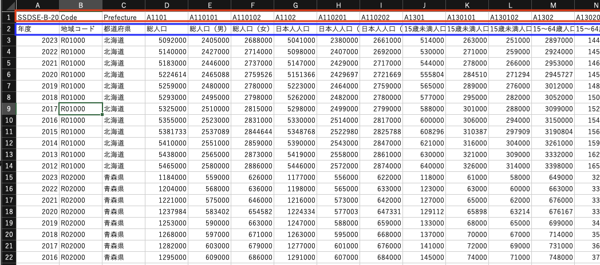

`SSDSE-B-2026.csv`をexcelで開いて、生データがどのような問題を抱えているかを確認しよう。3行目以降は実際のデータであり、基本的には整然とした表形式データになっている。一方、1行目は英数字で構成された変数名であり、2行目は各変数の日本語による説明である。また、SSDSE は UTF-8 ではなく、Shift-JIS 系のエンコードが使われているため、encoding を指定しないと、データ導入がうまくいかない。

```{r}
# Shift-JISを指定し、SSDSEをRに導入
raw <- read.csv("./data/SSDSE-B-2026.csv", fileEncoding = "Shift-JIS", header = TRUE)

head(raw)
```

導入したデータの先頭部分には日本語の説明行が含まれており、やや複雑である。また、列内に日本語が含まれているため、本来は数値である変数まで文字列として読み込まれてしまうという新たな問題も発生する。例えば、A1101（総人口）の変数は本来であれば実数型として扱うべきである。しかし、日本語を含む行の影響により、`chr`（文字型）として読み込まれてしまい、このままではデータ分析に利用できない。

一つの方法としては、（元データの）2行目を削除した上でデータを導入することである。ただし、この方法では変数名だけでは変数の意味が分からなくなるため、その都度 codebook （[PDF](./data/kaisetsu-B-2026.pdf)）を確認しながらプログラミングを行う必要がある。

ここでは、（元データの）2行目を有効活用する方法を紹介する。できるだけ変数に関する情報をデータ内に残しておいた方が、後のプログラミング作業やデータ分析をスムーズに進めることができるためである。

元データの2行目に含まれる情報を、1行目の変数名に対応するラベルとして付与する。

```{r}
# 初回のみインストール
# install.packages("labelled")
library(labelled)

# 変数名を保存
var_names <- names(raw)

# 元データの2行目(導入後データの1行目)をラベルとして保存(年度、地域コード、都道府県...)
labels <- as.character(raw[1, ])

# 元データの2行目(導入後データの1行目)を削除し、行番号をリセットする
raw <- raw[-1, ]
rownames(raw) <- NULL 

# (誤って)文字列として読み込まれているデータを、可能であれば適切な型に自動変換する
raw <- type.convert(raw, as.is = TRUE)

# ラブルを変数名に付与する
var_label(raw) <- setNames(as.list(labels), var_names)
```

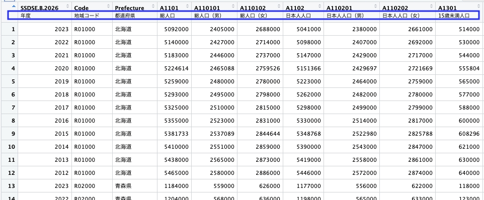

前処理後のデータでは、変数名の下に対応する日本語情報（変数ラベル）が保持されたまま、`data.frame` 構造として整理されている。個別の変数を用いて計算を行う場合でも、外部のcodebookを逐一参照する必要がなく、R内部だけで変数の意味を確認しながら分析を完結できる。

### 雑なheaderの場合
https://www.e-stat.go.jp/dbview?sid=0003191320

上記、e-statに公開している日本の犯罪統計を確認しよう。

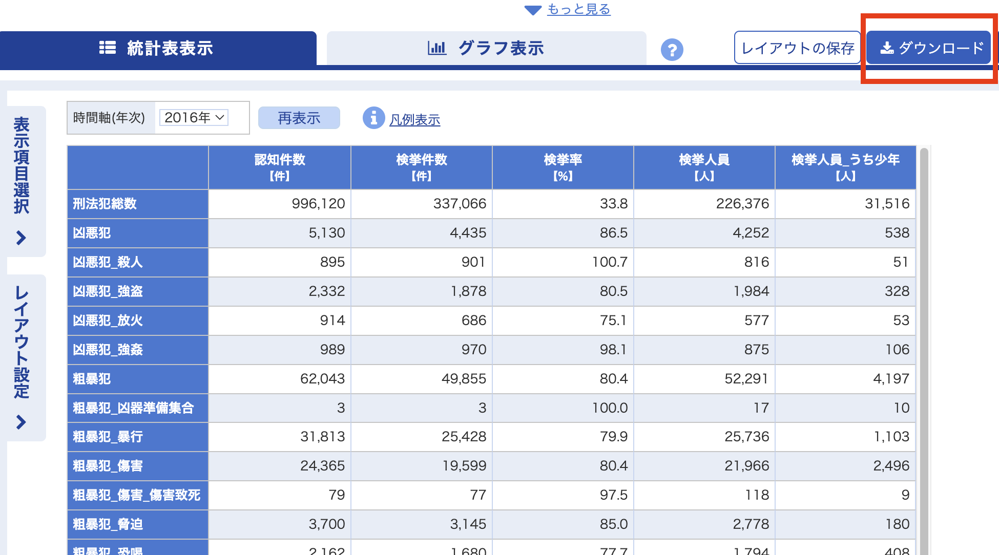

日本のデータは、多くの場合、データ分析に不要な情報がheader部分に含まれている。数十個のデータを扱う場合でも、headerの構造が統一されていれば、プログラムで一括処理することはそれほど難しくない。しかし、データごとに構造が異なる場合には、毎回ファイルを開いて確認し、<u>「先頭何行を削除するか」</u>を判断しなければならず、非常に面倒な作業になってくる。

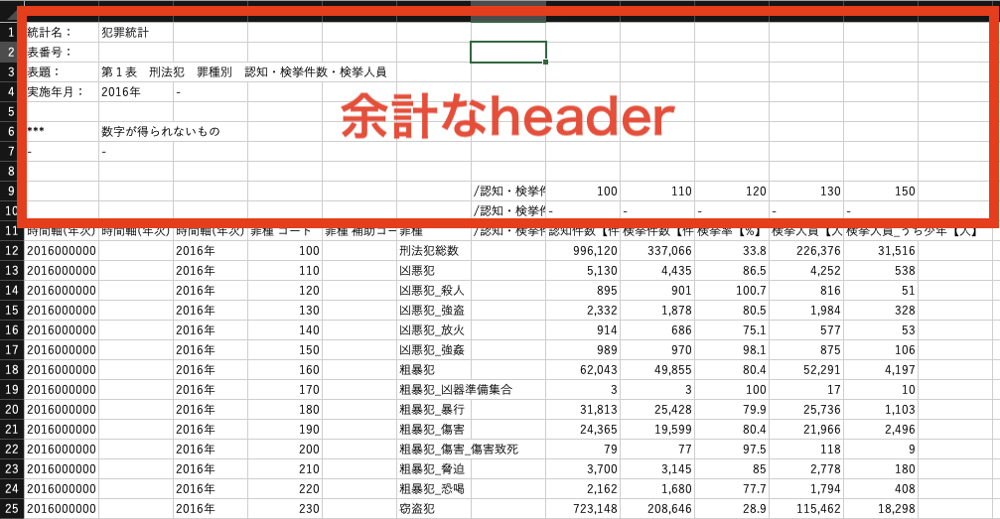
データ分析の初心者は、Excelなどを用いて手動でheader部分を削除する人が多い。しかし、この方法は再現性が低く、作業ミスも発生しやすいため、基本的には推奨しない。特に、元データを直接編集してしまうと、「どのような処理を行ったのか」が後から追跡できなくなる。データ前処理では、元データ（raw data）はそのまま保存し、Rのプログラム上で不要なheader行を除去することが望ましい。

または、e-Stat からデータをダウンロードする際に、UTF-8形式で保存したり、ヘッダ情報の出力をオフにしたりすることで、最初からクリーンなデータを取得することもできる。

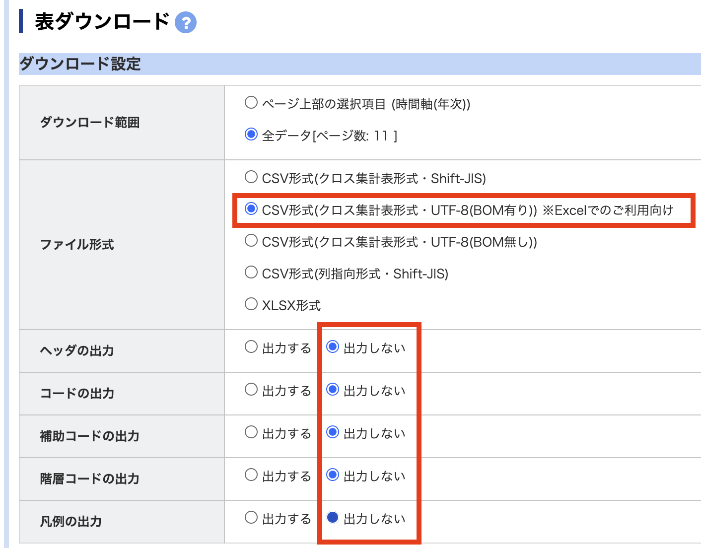{width=80%}

そうすると、きれいなデータだけが得られるため、Rに導入した後は、変数名を処理するだけでよい。各自の研究で参考にしていただけたら。
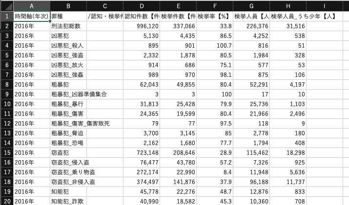

## 課題
今回は課題はないが、各自でインターネット上から何らかのデータを探し、Rへの導入を試してみてほしい。実際のデータは、それぞれ形式や構造が異なるため、状況に応じて臨機応変に処理する必要がある。ただし、同じ系列のデータは似た構造を共有していることが多く、一度プログラムを書けば、そのまま他のファイルにも応用して整理できる場合が多い。特に、日本の統計データでは、header構造や文字コードが共通しているケースも多いため、「再利用可能な前処理コード」を作る意識が重要である。

次回は、データ前処理用のパッケージについて説明し、やや複雑な課題を課す予定である。今回扱ったデータ導入やheader処理について、各自で復習しておいてください。